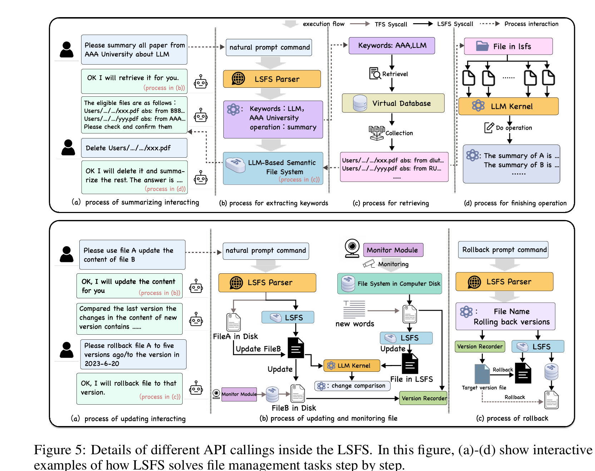
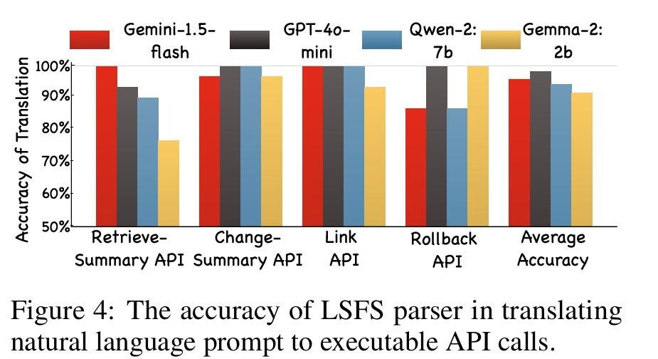

# 针对扩展LSFS的可行性研究报告
小组成员：于宛扬 杨玺禾 韩思琦 贾钰珩

在4.10的线下会议中，小组成员讨论了数据集构建部分的可行性(见Overall.md)，集体部署了AIOS并体验了其提供的LSFS(LLM-based Semantic File System)，就首要任务达成一致：扩展LSFS，使之支持可执行文件和相关操作的语义获取，从而为智能预测内存管理提供支持。下面的报告由杨玺禾撰写，于宛扬校对整理。

- [针对扩展LSFS的可行性研究报告](#针对扩展lsfs的可行性研究报告)
  - [1. 理论依据](#1-理论依据)
    - [1.1 基于LLM的语义文件系统（LSFS）概述](#11-基于llm的语义文件系统lsfs概述)
    - [1.2 语义文件系统研究价值](#12-语义文件系统研究价值)
    - [1.3 LSFS工作机制](#13-lsfs工作机制)
    - [1.4 LSFS主要贡献](#14-lsfs主要贡献)
  - [2. 支持可执行文件语义的LSFS技术实现路径](#2-支持可执行文件语义的lsfs技术实现路径)
    - [2.1 系统架构](#21-系统架构)
    - [2.2 核心组件优化](#22-核心组件优化)
      - [2.2.1 LSFS解析器扩展](#221-lsfs解析器扩展)
      - [2.2.2 基本Syscall实现](#222-基本syscall实现)
      - [2.2.3 高级API实现](#223-高级api实现)
    - [2.3 安全保障机制](#23-安全保障机制)
  - [3. 计划可行性评估](#3-计划可行性评估)
    - [3.1 自然语言转换能力](#31-自然语言转换能力)
    - [3.2 文件操作支持范围](#32-文件操作支持范围)
    - [3.3 与AIOS集成评估](#33-与aios集成评估)
    - [3.4 安全机制评估](#34-安全机制评估)
    - [3.5 性能评估](#35-性能评估)
  - [4. 结论与建议](#4-结论与建议)
    - [4.1 总体可行性结论](#41-总体可行性结论)
    - [4.2 实施建议](#42-实施建议)
    - [4.3 未来扩展方向](#43-未来扩展方向)

## 1. 理论依据

### 1.1 基于LLM的语义文件系统（LSFS）概述

随着大规模语言模型（LLMs）在智能体领域的应用取得了显著进展，文件操作管理仍然依赖于传统的手动命令输入和复杂的文件系统导航，这种交互方式在现代文件管理中存在一定的瓶颈。用户需要记住复杂的文件名并在繁琐的文件夹结构中进行精确导航，极大降低了使用体验。为了解决这一问题，AIOS小组提出了一种新的方法：LLM-based语义文件系统（LSFS），用于在LLM智能体操作系统（AIOS）中实现基于自然语言提示的文件管理。

LSFS与传统文件系统的不同之处在于，它利用LLM的强大能力，使用户或智能体能够通过自然语言提示来进行文件管理，从而实现更加直观和语义化的文件操作。通过这种方式，用户无需记住文件名或手动浏览文件夹结构，只需通过简单的语句即可完成文件的各种操作。

在宏观层面上，研究团队开发了一整套API来支持语义文件管理功能，包括语义文件检索、文件更新摘要以及语义文件回滚等操作。在微观层面上，LSFS通过构建语义索引来存储文件，支持多种语义操作的系统调用，如CRUD操作（创建、读取、更新、删除）、分组操作和联接操作。这些功能使得文件管理不仅仅局限于简单的文件存取，而是能够处理更加复杂和语义化的任务。

实验结果表明，LSFS在以下几个方面表现出色：首先，在语义文件检索任务中，LSFS比传统文件系统提高了至少15%的检索准确性，并且检索速度提高了2.1倍。其次，在传统的关键字匹配检索任务中，LSFS的F1-score稳定在89%以上，尤其是在关键词条件变得更复杂时，LSFS表现出了更高的可用性。最后，LSFS还支持语义文件回滚和文件共享等高级文件管理操作，并在这些任务中实现了100%的成功率，进一步证明了LSFS的强大能力。

综上所述，LSFS不仅提升了传统文件系统的检索效率和准确性，还拓展了文件管理的功能边界，能够处理更加复杂的语义化任务。这表明LSFS在文件管理领域具有革命性的潜力，为用户提供了更加智能和高效的交互方式。

### 1.2 语义文件系统研究价值

随着大规模语言模型（LLMs）在智能体领域的广泛应用，传统文件系统面临着一系列挑战。

首先，当两个文件内容相似，且无法通过简单的字符串匹配区分时，**传统文件系统无法基于内容相似性进行文件的组织或检索**。

> eg: 假设你有两个文档，分别是《科技趋势报告》和《未来科技展望》。这两个文档的内容都有很多相似的段落，比如它们都提到人工智能的发展、5G技术的影响等。如果我们只使用传统的文件系统进行简单的字符串匹配，系统可能会将这两个文件视为不同的文件，因为它们的文件名不同，或者是因为在某些段落使用的词语不同。
> 但是，如果我们想根据内容的相似性来组织或检索这些文件，比如希望找到所有提到“人工智能”的文件，传统的文件系统就无法做到，因为它只关注文件名和结构，而忽略了内容本身的相似性。
> 因此，段落的意思是强调传统文件系统在处理相似内容方面的局限性，缺乏通过内容相似性来有效地组织和检索文件的能力。

其次，用户与传统文件系统的交互往往需要复杂的操作系统命令或手动通过用户界面导航，迫使用户精确记住文件的名称或位置。对于文件数量庞大的系统，文件检索过程效率低下且耗时，严重影响了系统的整体可用性。

>具体来说：
> 1. 复杂的操作系统命令：许多操作系统（尤其是早期版本）需要用户输入特定的命令行指令才能执行文件操作，比如打开、移动或删除文件。这种方式对普通用户来说可能比较困难，因为他们需要记住正确的指令。

> 2. 手动导航：对于不熟悉命令行的用户，他们通常依赖图形用户界面（GUI）进行操作。这意味着用户需要通过点击文件夹、浏览文件树等方式来寻找文件。这一过程可能会很耗时，尤其是当文件数量较多或文件组织结构复杂时。

>3.  记住文件名或位置：用户在使用这类系统时，必须要记住文件的名称或存储的确切位置（例如某个文件夹的路径）。如果用户忘记了文件的名称，或者对文件所在的文件夹不记得清楚，就很难找到所需的文件。

相较而言，LSFS可以做出如下改善。

1. **用户体验改善**：针对用户与文件系统交互时的复杂性问题，LSFS将LLM集成到复杂功能的API中，引入模板系统提示，使用户可以通过自然语言输入来简化文件管理操作。相比传统文件系统需要用户记住精确的命令和路径，LSFS仅需用户输入自然语言描述，系统即可理解并执行相应操作，大大简化了操作复杂度。
2. **语义化检索**：为了解决文件内容相似性无法通过字符串匹配检索的问题，LSFS引入了基于语义的索引结构，利用向量数据库进行文件存储。通过从文件内容中提取语义特征并生成相应的嵌入向量，LSFS将语义信息融入文件操作中，从而实现更加智能的文件检索。
3. **系统调用接口设计**：为了增强文件管理的灵活性，我们设计了多个可重用的系统调用接口，模仿传统文件系统的功能。这些系统调用不仅可以实现文件系统的基本功能，还能提供传统文件系统未包括的高级操作。
4. **安全机制设计**：为了减少LLM生成不准确指令，特别是不可逆操作的误生成问题，LSFS设计了系统性的安全保障机制。例如，在执行不可逆操作之前进行安全检查，并在指令执行前进行用户验证。这些措施有效保障了文件管理操作的安全性和准确性。

### 1.3 LSFS工作机制
下图解释了LSFS的工作机制：

靠上图的图展示了 retrieve summary API的工作流：
> (a). process of summarizing interacting: 该层用于用户输入自然语言总结提示，也用于agent对用户的要求与最终处理结果进行回复。用户还可以对agent提出进一步的要求和改善意见。
> (b).process of extracting keywords:LSFS Parser将用户的自然语言命令转换为可以被文件系统调用的结构化的JSON格式数据，并传递给LSFS系统。
> (c).process of retrieving:根据生成的keywords，LSFS文件系统进入虚拟数据库进行检索，找到文件后生成传统操作系统能够对应的文件路径，并传递给传统系统。
> (d).process of finishing operations:传统操作系统取出文件，由LLM进行对应的修改与分析，最终结果传输给用户。

靠下方的图展示了 change-summary API 和 rollback API的工作流。
> (a). process of updating interacting: 该层用于用户输入自然语言更新提示，也用于agent对用户的要求与最终处理结果进行回复。用户还可以对agent提出进一步的要求和改善意见。
> (b). process of updating and monitoring file:经过parser转译后，由LSFS和传统操作系统联合修改文件，由于涉及到不可逆操作，此时需要监控管理系统。
> (c).process of rollback: 调取version recorder中的信息，回滚到之前的版本。
> 
### 1.4 LSFS主要贡献

1. **语义文件存储结构**：提出了基于LLM的语义文件系统（LSFS），以语义化的方式管理文件。通过改变文件存储结构和方法，LSFS融入了文件的语义上下文，优化了传统文件系统的基本功能。此外，我们开发了多种可重用的系统调用（syscalls）和API，扩展了系统功能，并为未来的系统发展奠定了基础。
2. **LSFS解析器**：设计了LSFS解析器，可以**将自然语言提示解析为可执行的LSFS支持的API，从而执行相关的文件管理任务**。这使得用户能够通过简单的自然语言提示来控制和管理文件，充当用户/智能体指令与系统操作之间的桥梁。
3. **系统安全保障机制**：为了避免LSFS中的非预期操作，特别是不可逆操作，研究团队设计了系统性的安全保障机制，如对不可逆操作的安全检查和执行前的用户验证，确保LSFS的安全性和准确性。

## 2. 支持可执行文件语义的LSFS技术实现路径

### 2.1 系统架构

LSFS作为传统文件系统之上的附加层，作为代理/用户与传统文件系统之间的桥梁。系统采用分层架构：

1. **用户层**：接收自然语言命令
2. **LSFS解析器**：将自然语言转换为API调用
3. **API层**：提供复杂文件管理功能
4. **Syscall层**：提供基本文件操作
5. **监督器**：监控传统文件系统的变化，并同步到LSFS

**以下架构部分在我们部署AIOS后均可直接调用，我们的工作转化为考虑针对可执行文件在LSFS不同架构层中进行优化可功能扩展。**

### 2.2 核心组件优化

#### 2.2.1 LSFS解析器扩展

LSFS解析器使用LLM（默认为GPT-4o-mini）将自然语言提示解析为**结构化的JSON格式数据**，包括API函数名和参数。

为了评估LSFS解析器的有效性，AIOS团队评估了LSFS解析器将用户的自然语言提示转换为可执行的LSFS API调用的准确性。他们针对不同的LLM基础模型（例如Gemini-1.5-Flash、GPT-4o-mini、Qwen-2和Gemma-2），使用30个不同的样本来评估LSFS解析器的准确性。结果如下图所示。

针对我们的项目，我们需要考虑LSFS解析器是否能解析我们希望实现的命令，并且要考虑这些命令的解析性能。

#### 2.2.2 基本Syscall实现

LSFS设计了两类基本系统调用：

1. **原子Syscall**：
   - `create_or_get_file()`：创建、读取和打开文件
   - `add_()`：向文件末尾添加内容
   - `overwrite()`：覆盖原始文件内容
   - `del_()`：删除指定文件
   - `keywords_retrieve()`：基于关键字检索文件
   - `semantic_retrieve()`：基于语义相似度检索文件

2. **组合Syscall**：
   - `create()`：批量创建文件
   - `lock_file()/unlock_file()`：锁定/解锁文件
   - `group_semantic()/group_keywords()`：基于语义/关键字分组文件
   - `integrated_retrieve()`：组合关键字和语义检索
   - `file_join()`：连接两个文件
  

#### 2.2.3 高级API实现

基于Syscall，LSFS设计了以下API：

1. **Retrieve-Summary API**：检索文件并提供摘要
2. **Change-Summary API**：修改文件内容并比较变化
3. **Rollback API**：将文件回滚到特定版本
4. **Link API**：生成可共享的文件链接

**针对LSFS目前提供的调用语句，我们将分析这些语句对二进制文件的可支持性。我们考虑实现更多的功能，以及在原有功能基础上做出改善。**

### 2.3 安全保障机制

LSFS实现了多层安全保障机制：

1. **进程锁**：防止对同一文件的一致性读写
2. **用户确认步骤**：文件变更时需要用户二次确认
3. **版本回滚操作**：错误操作后可以回滚到正确版本

根据以上内容，我们可以提出以下问题：
1. **二进制文件需要哪些安全性保障机制？**
2. **这些安全性保障机制在AIOS原有系统中是否已经实现？**
3. **针对我们增添的文件操作功能，与要有哪些额外的机制来保障安全性**

## 3. 计划可行性评估

### 3.1 自然语言转换能力

LSFS解析器已经证明能够将自然语言命令有效转换为系统API调用，准确率达到90%。对于错误解析的情况，系统设计了二次解析机制，可将大多数API的成功率提升至100%。这表明将自然语言转换为元语言的功能是可实现的。

### 3.2 文件操作支持范围

目前LSFS支持以下文件操作类型：

1. **文本文件**：完全支持（.txt, .md, .pdf, .docx等）
2. **二进制文件**：部分支持（主要用于检索，不用于内容修改）

对于二进制文件的处理，LSFS采取了谨慎策略：
- 支持二进制文件的读取和检索
- 不支持直接修改二进制文件内容，以避免潜在的文件损坏
- 对于需要修改的二进制文件，提供文件替换而非内容修改操作

### 3.3 与AIOS集成评估

AIOS目前实现的功能与LSFS的需求匹配情况：

| AIOS功能 | 实现状态 | LSFS需求 | 兼容性 |
|---------|---------|---------|-------|
| 文件读取 | 已实现   | 需要     | 良好   |
| 文件写入 | 已实现   | 需要     | 良好   |
| 文件检索 | 部分实现 | 需要     | 需扩展 |
| 版本控制 | 未实现   | 需要     | 需实现 |
| 权限管理 | 已实现   | 需要     | 良好   |

### 3.4 安全机制评估

LSFS对于安全问题的处理已经有初步设计，但还需要进一步加强：

1. **已实现的安全机制**：
   - 用户确认机制（验证表明可将误操作率降至0%）
   - 进程锁机制（避免文件损坏）
   - 版本控制（支持回滚）

2. **需要加强的安全机制**：
   - 二进制文件操作的特殊保护
   - 权限管理的细粒度控制
   - 加密通信确保敏感数据安全

### 3.5 性能评估

初步性能测试结果显示LSFS在关键指标上优于传统方法：

1. **语义文件检索**：
   - 准确率提升至少15%
   - 检索速度提高2.1倍

2. **关键词检索**：
   - F1分数保持在89%以上
   - 用户操作时间减少87%

3. **文件回滚**：
   - 成功率达100%
   - 支持时间和版本号两种回滚方式

4. **文件共享**：
   - 链接生成成功率100%
   - 支持设置过期时间

## 4. 结论与建议

### 4.1 总体可行性结论

基于上述分析，实现LSFS是理论与技术上可行的。该系统在语义文件管理方面展现了显著优势，同时在传统文件管理任务中也保持了良好的功能性。

### 4.2 实施建议

1. **分阶段实施**：
   - 第一阶段：调查AIOS支持的二进制文件操作元语
   - 第二阶段：扩展新的元语，提升原有操作的性能
   - 第三阶段：增强针对二进制文件的安全机制

2. **优先支持的文件类型**：
   - 首先支持纯文本和常见文档格式(.txt, .md, .pdf, .docx)
   - 随后扩展到结构化数据文件(.csv, .json, .xml)
   - 最后考虑其他类型文件的有限支持

3. **安全机制强化**：
   - 实现细粒度的权限控制系统
   - 为敏感操作增加额外的验证步骤
   - 建立完善的日志记录和审计系统

### 4.3 未来扩展方向

1. **多模态和多扩展文件管理**：扩展对非文本文件的语义操作支持
2. **安全性和隐私增强**：研究数据加密技术以保护文件与LLM交互中的隐私
3. **优化检索策略**：集成更先进的检索算法，提高检索精度和效率
4. **更多实例化API和syscall**：根据用户需求扩展更多功能性接口

通过以上内容的实施，LSFS可以成为一个更智能、更用户友好的操作系统，为基于LLM的代理提供强大的文件管理基础设施。