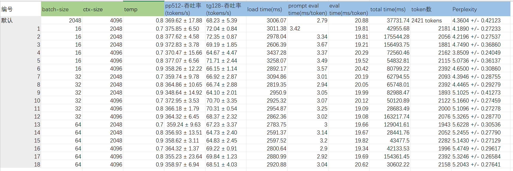
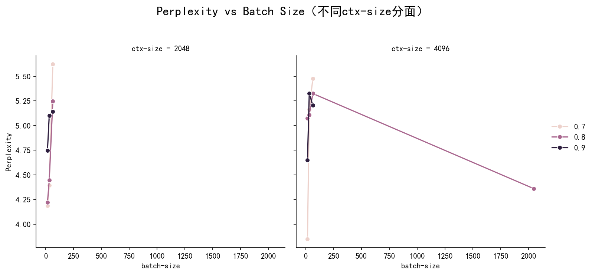
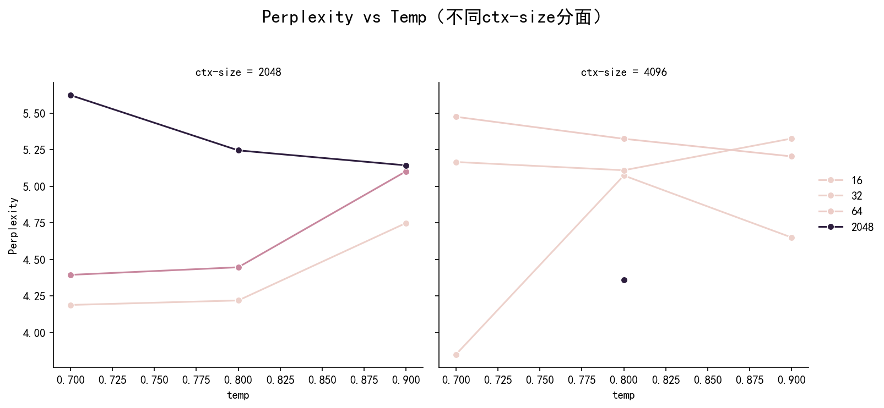
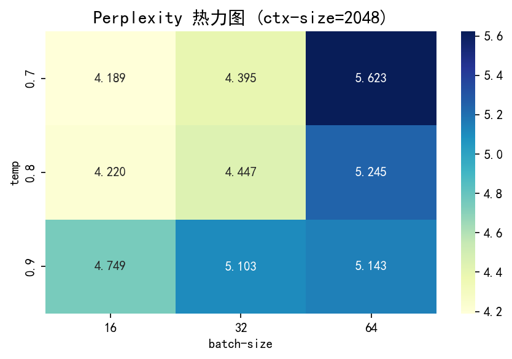
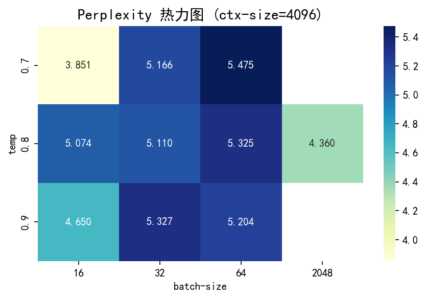
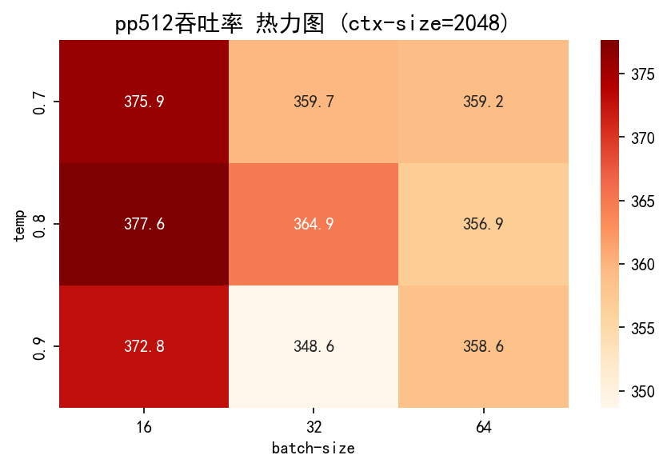
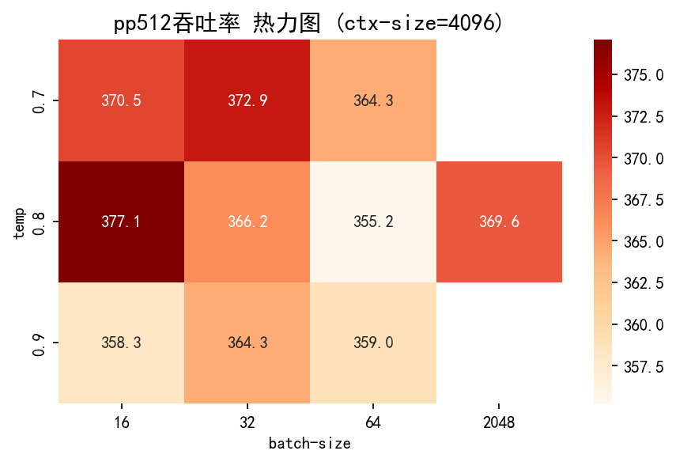
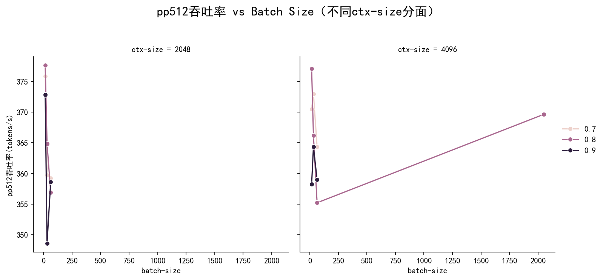

# llama.cpp in CPU

##准备工作

创建虚拟环境和激活

```bash
hester_wsl@Hester:/mnt/d/霍格沃兹/大三下/操作系统OSH/大作业/lab 4/llama.cpp$ source osh/bin/activate
```


## 参数的选择与获取

### 参数的获取

在llama.cpp目录下

用下面的命令来让**模型输出文字**

```r
./build/bin/llama-cli -m Qwen3-0.6B-Q8_0.gguf -p "用一句话介绍操作系统实验。"
```

用下面的命令**获取相关性能数据**

```r
./build/bin/llama-bench -m Qwen3-0.6B-Q8_0.gguf
```

另外把输出的文字放进file.txt中后，可用下面命令**计算困惑度**

```python
./build/bin/llama-perplexity -m Qwen3-0.6B-Q8_0.gguf -f file.txt
```


### 参数的解释与选择

#### 1. `llama-cli` 性能相关输出解释

当你运行 `llama-cli` 生成文本时，会输出很多关于模型加载、环境、采样和推理过程的信息。

类似如下：

```python
(osh) hester_wsl@Hester:/mnt/d/霍格沃兹/大三下/操作系统OSH/大作业/lab 4/llama.cpp$ ./build/bin/llama-cli -m Qwen3-0.6B-Q8_0.gguf -p "用一句话介绍操作系统实验。"
build: 5605 (5787b5da) with cc (Ubuntu 13.3.0-6ubuntu2~24.04) 13.3.0 for x86_64-linux-gnu
main: llama backend init
main: load the model and apply lora adapter, if any
llama_model_loader: loaded meta data with 28 key-value pairs and 310 tensors from Qwen3-0.6B-Q8_0.gguf (version GGUF V3 (latest))
llama_model_loader: Dumping metadata keys/values. Note: KV overrides do not apply in this output.
llama_model_loader: - kv   0:                       general.architecture str              = qwen3
llama_model_loader: - kv   1:                               general.type str              = model
llama_model_loader: - kv   2:                               general.name str              = Qwen3 0.6B Instruct
llama_model_loader: - kv   3:                           general.finetune str              = Instruct
llama_model_loader: - kv   4:                           general.basename str              = Qwen3
llama_model_loader: - kv   5:                         general.size_label str              = 0.6B
llama_model_loader: - kv   6:                          qwen3.block_count u32              = 28
llama_model_loader: - kv   7:                       qwen3.context_length u32              = 40960
llama_model_loader: - kv   8:                     qwen3.embedding_length u32              = 1024
llama_model_loader: - kv   9:                  qwen3.feed_forward_length u32              = 3072
llama_model_loader: - kv  10:                 qwen3.attention.head_count u32              = 16
llama_model_loader: - kv  11:              qwen3.attention.head_count_kv u32              = 8
llama_model_loader: - kv  12:                       qwen3.rope.freq_base f32              = 1000000.000000
llama_model_loader: - kv  13:     qwen3.attention.layer_norm_rms_epsilon f32              = 0.000001
llama_model_loader: - kv  14:                 qwen3.attention.key_length u32              = 128
llama_model_loader: - kv  15:               qwen3.attention.value_length u32              = 128
llama_model_loader: - kv  16:                       tokenizer.ggml.model str              = gpt2
llama_model_loader: - kv  17:                         tokenizer.ggml.pre str              = qwen2
llama_model_loader: - kv  18:                      tokenizer.ggml.tokens arr[str,151936]  = ["!", "\"", "#", "$", "%", "&", "'", ...
llama_model_loader: - kv  19:                  tokenizer.ggml.token_type arr[i32,151936]  = [1, 1, 1, 1, 1, 1, 1, 1, 1, 1, 1, 1, ...
llama_model_loader: - kv  20:                      tokenizer.ggml.merges arr[str,151387]  = ["Ġ Ġ", "ĠĠ ĠĠ", "i n", "Ġ t",...    
llama_model_loader: - kv  21:                tokenizer.ggml.eos_token_id u32              = 151645
llama_model_loader: - kv  22:            tokenizer.ggml.padding_token_id u32              = 151643
llama_model_loader: - kv  23:                tokenizer.ggml.bos_token_id u32              = 151643
llama_model_loader: - kv  24:               tokenizer.ggml.add_bos_token bool             = false
llama_model_loader: - kv  25:                    tokenizer.chat_template str              = \n    {{- '<|im_start|>...
llama_model_loader: - kv  26:               general.quantization_version u32              = 2
llama_model_loader: - kv  27:                          general.file_type u32              = 7
llama_model_loader: - type  f32:  113 tensors
llama_model_loader: - type q8_0:  197 tensors
print_info: file format = GGUF V3 (latest)
print_info: file type   = Q8_0
print_info: file size   = 604.15 MiB (8.50 BPW)
load: special tokens cache size = 26
load: token to piece cache size = 0.9311 MB
print_info: arch             = qwen3
print_info: vocab_only       = 0
print_info: n_ctx_train      = 40960
print_info: n_embd           = 1024
print_info: n_layer          = 28
print_info: n_head           = 16
print_info: n_head_kv        = 8
print_info: n_rot            = 128
print_info: n_swa            = 0
print_info: is_swa_any       = 0
print_info: n_embd_head_k    = 128
print_info: n_embd_head_v    = 128
print_info: n_gqa            = 2
print_info: n_embd_k_gqa     = 1024
print_info: n_embd_v_gqa     = 1024
print_info: f_norm_eps       = 0.0e+00
print_info: f_norm_rms_eps   = 1.0e-06
print_info: f_clamp_kqv      = 0.0e+00
print_info: f_max_alibi_bias = 0.0e+00
print_info: f_logit_scale    = 0.0e+00
print_info: f_attn_scale     = 0.0e+00
print_info: n_ff             = 3072
print_info: n_expert         = 0
print_info: n_expert_used    = 0
print_info: causal attn      = 1
print_info: pooling type     = 0
print_info: rope type        = 2
print_info: rope scaling     = linear
print_info: freq_base_train  = 1000000.0
print_info: freq_scale_train = 1
print_info: n_ctx_orig_yarn  = 40960
print_info: rope_finetuned   = unknown
print_info: ssm_d_conv       = 0
print_info: ssm_d_inner      = 0
print_info: ssm_d_state      = 0
print_info: ssm_dt_rank      = 0
print_info: ssm_dt_b_c_rms   = 0
print_info: model type       = 0.6B
print_info: model params     = 596.05 M
print_info: general.name     = Qwen3 0.6B Instruct
print_info: vocab type       = BPE
print_info: n_vocab          = 151936
print_info: n_merges         = 151387
print_info: BOS token        = 151643 '<|endoftext|>'
print_info: EOS token        = 151645 '<|im_end|>'
print_info: EOT token        = 151645 '<|im_end|>'
print_info: PAD token        = 151643 '<|endoftext|>'
print_info: LF token         = 198 'Ċ'
print_info: FIM PRE token    = 151659 '<|fim_prefix|>'
print_info: FIM SUF token    = 151661 '<|fim_suffix|>'
print_info: FIM MID token    = 151660 '<|fim_middle|>'
print_info: FIM PAD token    = 151662 '<|fim_pad|>'
print_info: FIM REP token    = 151663 '<|repo_name|>'
print_info: FIM SEP token    = 151664 '<|file_sep|>'
print_info: EOG token        = 151643 '<|endoftext|>'
print_info: EOG token        = 151645 '<|im_end|>'
print_info: EOG token        = 151662 '<|fim_pad|>'
print_info: EOG token        = 151663 '<|repo_name|>'
print_info: EOG token        = 151664 '<|file_sep|>'
print_info: max token length = 256
load_tensors: loading model tensors, this can take a while... (mmap = true)
load_tensors:   CPU_Mapped model buffer size =   604.15 MiB
...........................................................................
llama_context: constructing llama_context
llama_context: n_seq_max     = 1
llama_context: n_ctx         = 4096
llama_context: n_ctx_per_seq = 4096
llama_context: n_batch       = 2048
llama_context: n_ubatch      = 512
llama_context: causal_attn   = 1
llama_context: flash_attn    = 0
llama_context: freq_base     = 1000000.0
llama_context: freq_scale    = 1
llama_context: n_ctx_per_seq (4096) < n_ctx_train (40960) -- the full capacity of the model will not be utilized
llama_context:        CPU  output buffer size =     0.58 MiB
llama_kv_cache_unified:        CPU KV buffer size =   448.00 MiB
llama_kv_cache_unified: size =  448.00 MiB (  4096 cells,  28 layers,  1 seqs), K (f16):  224.00 MiB, V (f16):  224.00 MiB
llama_context:        CPU compute buffer size =   298.75 MiB
llama_context: graph nodes  = 1126
llama_context: graph splits = 1
common_init_from_params: setting dry_penalty_last_n to ctx_size = 4096
common_init_from_params: warming up the model with an empty run - please wait ... (--no-warmup to disable)
main: llama threadpool init, n_threads = 11
main: chat template is available, enabling conversation mode (disable it with -no-cnv)
*** User-specified prompt will pre-start conversation, did you mean to set --system-prompt (-sys) instead?
main: chat template example:
<|im_start|>system
You are a helpful assistant<|im_end|>
<|im_start|>user
Hello<|im_end|>
<|im_start|>assistant
Hi there<|im_end|>
<|im_start|>user
How are you?<|im_end|>
<|im_start|>assistant


system_info: n_threads = 11 (n_threads_batch = 11) / 22 | CPU : SSE3 = 1 | SSSE3 = 1 | AVX = 1 | AVX_VNNI = 1 | AVX2 = 1 | F16C = 1 | FMA = 1 | BMI2 = 1 | LLAMAFILE = 1 | OPENMP = 1 | AARCH64_REPACK = 1 |

main: interactive mode on.
sampler seed: 3301105273
sampler params:
        repeat_last_n = 64, repeat_penalty = 1.000, frequency_penalty = 0.000, presence_penalty = 0.000
        dry_multiplier = 0.000, dry_base = 1.750, dry_allowed_length = 2, dry_penalty_last_n = 4096
        top_k = 40, top_p = 0.950, min_p = 0.050, xtc_probability = 0.000, xtc_threshold = 0.100, typical_p = 1.000, top_n_sigma = -1.000, temp = 0.800
        mirostat = 0, mirostat_lr = 0.100, mirostat_ent = 5.000
sampler chain: logits -> logit-bias -> penalties -> dry -> top-n-sigma -> top-k -> typical -> top-p -> min-p -> xtc -> temp-ext -> dist
generate: n_ctx = 4096, n_batch = 2048, n_predict = -1, n_keep = 0

== Running in interactive mode. ==
 - Press Ctrl+C to interject at any time.
 - Press Return to return control to the AI.
 - To return control without starting a new line, end your input with '/'.
 - If you want to submit another line, end your input with '\'.
 - Not using system message. To change it, set a different value via -sys PROMPT

user
用一句话介绍操作系统实验。
assistant
<think>
好的，用户让我用一句话介绍操作系统实验。首先，我需要理解用户的需求。操作系统实验通常包括Linux系统的配置、进程管理、文件系统操作、网络通信等方面。用户可能希望简洁明了，一句话涵盖关键内容。

接下来，我要考虑用户的身份。可能是学生，刚学操作系统，或者老师布置实验。他们可能需要一句话来概述实验目的和主要内容，以便快速理解
。

然后，我需要确定实验的核心要素。通常实验会涉及基础操作，如安装、配置、管理，以及高级功能如进程、文件系统和网络。要确保一句话能涵
盖这些点。

还要注意用户可能没有明确提到的深层需求。比如，他们可能希望这句话既包含实验内容，又说明学习的目标，这样能更好地指导他们。同时，避
免过于技术化的术语，保持通俗易懂。

最后，检查语法和用词是否准确，确保一句话流畅且信息完整。这样用户就能快速掌握实验的核心内容和学习重点。
</think>

操作系统实验旨在通过Linux系统配置、进程管理、文件系统与网络通信等操作，掌握基础操作与高级功能。

>
llama_perf_sampler_print:    sampling time =      34.90 ms /   245 runs   (    0.14 ms per token,  7020.66 tokens per second)    
llama_perf_context_print:        load time =    4229.89 ms
llama_perf_context_print: prompt eval time =      53.44 ms /    14 tokens (    3.82 ms per token,   261.98 tokens per second)    
llama_perf_context_print:        eval time =    3932.66 ms /   230 runs   (   17.10 ms per token,    58.48 tokens per second)    
llama_perf_context_print:       total time =  283875.19 ms /   244 tokens
Interrupted by user
```

对**性能评估最有用的部分**主要在于：

##### **A. 推理相关时间参数**

- **sampling time**
   `llama_perf_sampler_print: sampling time = 34.90 ms / 245 runs (0.14 ms per token, 7020.66 tokens per second)`
  - **sampling time**: 采样阶段（生成下一个 token 的选择过程）总耗时
  - **runs**: 采样调用次数
  - **ms per token**: 每个 token 的平均采样耗时
  - **tokens per second**: 采样阶段的速度，**越高越好**
- **prompt eval time**
   `llama_perf_context_print: prompt eval time = 53.44 ms / 14 tokens (3.82 ms per token, 261.98 tokens per second)`
  - **prompt eval**: 对输入 prompt 进行“预处理”的耗时（通常是头几 token，初始化模型上下文）
  - **ms per token**: 评估 prompt 时每个 token 的平均耗时
  - **tokens per second**: prompt 阶段速度
- **eval time**
   `llama_perf_context_print: eval time = 3932.66 ms / 230 runs (17.10 ms per token, 58.48 tokens per second)`
  - **eval time**: 正式推理阶段的总耗时（即生成 token 的主过程）
  - **ms per token**: 每个 token 的平均生成耗时
  - **tokens per second**: 主体推理阶段速度
- **load time**
   `llama_perf_context_print: load time = 4229.89 ms`
  - **load time**: 加载模型到内存的总耗时，对**冷启动**性能有帮助
- **total time**
   `llama_perf_context_print: total time = 283875.19 ms / 244 tokens`
  - **total time**: 从开始到结束的全部耗时，包括所有阶段
  - **tokens**: 这次推理一共生成了多少 token

##### **B. 其他有用参数**

- **n_threads = 11**
   使用了 11 个线程。你可以通过 `--threads` 参数控制这个值，常常设为物理 CPU 核心数。
- 模型文件/架构/参数量
  - `print_info: arch = qwen3`
  - `print_info: model params = 596.05 M`（参数量约 6 亿）
  - `print_info: file type = Q8_0`（量化类型）


#### 2. `llama-bench` 输出解释

`llama-bench` 专门用于**评估模型性能**，输出的是**吞吐率（tokens/s）**，可直接比较不同配置下的推理速度。

输出示例：

| model           | size      | params   | backend | threads | test  | t/s           |
| --------------- | --------- | -------- | ------- | ------- | ----- | ------------- |
| qwen3 0.6B Q8_0 | 604.15MiB | 596.05 M | CPU     | 11      | pp512 | 351.46 ± 3.30 |
| qwen3 0.6B Q8_0 | 604.15MiB | 596.05 M | CPU     | 11      | tg128 | 71.68 ± 3.36  |

- test:
  - `pp512`：prompt perplexity 评估，通常是对语言建模质量的测试
  - `tg128`：token generation 128，指定生成 128 个 token 时的平均吞吐率
- **t/s**: tokens per second（平均每秒生成 token 数，性能核心指标，**越高越好**）


#### 3. 选择收集的性能参数

##### **A. 吞吐率（tokens/s）**

- 从 `llama-bench` 字段获取
- 测试不同线程数、不同模型、不同参数下的吞吐率

##### **B. 加载、评估、总耗时**（从llama-cli获取）

- `load time`：模型加载速度（只影响冷启动）
- `prompt eval time`：prompt 阶段速度
- `eval time`：主推理阶段速度
- `total time`：整体耗时

##### **C. 困惑度（Perplexity）**

- 由``llama-perplexity`字段获取，衡量语言建模质量，数值越低表示模型对文本的预测越准确（即“困惑”越少）


### 初始参数的记录以及线程数的选择

为了让性能测试更有说服力，我们设置了超难prompt如下：

```python
根据以下内容，写一篇1500字的英文介绍操作系统。

操作系统是管理和控制计算机硬件与软件资源的系统软件，是计算机系统中最基本的系统软件。操作系统的主要任务包括管理计算机的硬件和软件资源，为用户和应用程序提供接口，并保证系统的高效、稳定和安全运行。操作系统一般包括进程管理、内存管理、文件系统管理、设备管理和用户接口等基本功能模块。现代操作系统通常支持多任务、多用户和多处理器，并且能够适应各种硬件平台和应用需求。

人工智能（Artificial Intelligence，简称AI）是一门研究如何使计算机能够模拟人类智能行为的学科。人工智能涵盖了机器学习、自然语言处理、计算机视觉、专家系统等多个分支。随着计算能力的提升和大数据的涌现，人工智能技术在语音识别、图像识别、自动驾驶、智能推荐等领域得到了广泛应用。人工智能的发展不仅推动了科技进步，也对社会、经济和伦理等方面产生了深远影响。

操作系统为人工智能应用提供了坚实的基础。首先，操作系统能够高效地管理硬件资源，为AI应用分配处理器、内存和存储空间，确保任务的顺利运行。其次，操作系统支持多进程和多线程，为并行计算和分布式计算提供了环境，这对大规模神经网络训练和推理至关重要。此外，操作系统提供的安全机制能够防止恶意软件攻击和数据泄露，保障AI应用的数据安全与隐私保护。

现代操作系统的发展趋势包括微内核架构、虚拟化技术和容器化管理等。微内核操作系统将核心功能最小化，将其他服务移至用户空间，提高了系统的安全性和可维护性。虚拟化技术允许在同一物理硬件上运行多个操作系统实例，实现资源的灵活分配和隔离。容器技术则通过轻量级虚拟化，实现应用的快速部署和扩展。

人工智能的发展也对操作系统提出了新的挑战和机遇。首先，AI应用对计算资源的需求日益增长，操作系统需要优化资源调度算法，提高多核和异构计算环境下的资源利用率。其次，AI对实时性和高吞吐的需求要求操作系统支持低延迟的数据传输和高效的任务切换。此外，AI模型的安全性和可解释性也成为操作系统设计的重要考虑因素，例如如何隔离恶意模型、监控模型行为等。

总之，操作系统与人工智能的发展相辅相成。操作系统为AI应用提供了稳定、高效和安全的运行环境，而AI技术的进步又为操作系统的智能化管理和自适应优化提供了新的方向。未来，随着AI和操作系统的不断融合，智能操作系统将能够根据用户需求和系统状态，动态调整资源分配和优化策略，从而实现更高效、更可靠的计算平台。

人工智能的基本目标在于研究智能的本质，并生产出一种新的能够以人类智能相似方式做出反应的机器。人工智能是一门极具挑战性的科学，其核心问题包括机器学习、知识表达、推理、规划、自然语言处理和机器人学等。随着深度学习技术的飞速发展，卷积神经网络、循环神经网络、生成对抗网络等模型在图像识别、语音合成、自然语言生成等任务中取得了突破性进展。与此同时，强化学习在自动驾驶、游戏智能体等领域展现了强大的学习和决策能力。

操作系统的发展也受到了人工智能的深刻影响。越来越多的操作系统内核开始集成智能调度算法和异常检测机制，利用机器学习技术优化进程管理、内存分配和I/O调度等关键模块。例如，通过分析系统日志和性能指标，操作系统可以预测资源瓶颈并提前调整资源分配策略，从而提升系统整体性能和稳定性。智能化的安全防护模块能够实时检测异常行为，防止恶意软件和攻击的入侵。

此外，随着物联网和边缘计算的兴起，操作系统面临着分布式管理和自治决策的新要求。边缘设备的资源有限且分布广泛，操作系统需要具备自适应能力，根据任务优先级和网络状况动态调整应用部署和资源分配。人工智能为边缘操作系统提供了智能决策支持，使其能够根据实时数据自动优化运行参数，提高能效和服务质量。

未来，操作系统将继续与人工智能深度融合，推动信息技术的创新与发展。智能操作系统不仅能够理解用户需求，还能主动学习用户行为，实现个性化服务和自优化管理。随着量子计算、脑机接口等前沿技术的发展，操作系统和人工智能将在更广泛的应用场景中发挥重要作用，助力数字社会的智能化转型。
```

总结而言我们需要输入的指令如下：

```python
./build/bin/llama-cli --threads 20 -m Qwen3-0.6B-Q8_0.gguf -p "根据以下内容，写一篇1500字的英文介绍操作系统。

操作系统是管理和控制计算机硬件与软件资源的系统软件，是计算机系统中最基本的系统软件。操作系统的主要任务包括管理计算机的硬件和软件 
资源，为用户和应用程序提供接口，并保证系统的高效、稳定和安全运行。操作系统一般包括进程管理、内存管理、文件系统管理、设备管理和用 
户接口等基本功能模块。现代操作系统通常支持多任务、多用户和多处理器，并且能够适应各种硬件平台和应用需求。

人工智能（Artificial Intelligence，简称AI）是一门研究如何使计算机能够模拟人类智能行为的学科。人工智能涵盖了机器学习、自然语言处理、计算机视觉、专家系统等多个分支。随着计算能力的提升和大数据的涌现，人工智能技术在语音识别、图像识别、自动驾驶、智能推荐等领域得 
到了广泛应用。人工智能的发展不仅推动了科技进步，也对社会、经济和伦理等方面产生了深远影响。

操作系统为人工智能应用提供了坚实的基础。首先，操作系统能够高效地管理硬件资源，为AI应用分配处理器、内存和存储空间，确保任务的顺利 
运行。其次，操作系统支持多进程和多线程，为并行计算和分布式计算提供了环境，这对大规模神经网络训练和推理至关重要。此外，操作系统提 
供的安全机制能够防止恶意软件攻击和数据泄露，保障AI应用的数据安全与隐私保护。

现代操作系统的发展趋势包括微内核架构、虚拟化技术和容器化管理等。微内核操作系统将核心功能最小化，将其他服务移至用户空间，提高了系 
统的安全性和可维护性。虚拟化技术允许在同一物理硬件上运行多个操作系统实例，实现资源的灵活分配和隔离。容器技术则通过轻量级虚拟化， 
实现应用的快速部署和扩展。

人工智能的发展也对操作系统提出了新的挑战和机遇。首先，AI应用对计算资源的需求日益增长，操作系统需要优化资源调度算法，提高多核和异 
构计算环境下的资源利用率。其次，AI对实时性和高吞吐的需求要求操作系统支持低延迟的数据传输和高效的任务切换。此外，AI模型的安全性和 
可解释性也成为操作系统设计的重要考虑因素，例如如何隔离恶意模型、监控模型行为等。

总之，操作系统与人工智能的发展相辅相成。操作系统为AI应用提供了稳定、高效和安全的运行环境，而AI技术的进步又为操作系统的智能化管理 
和自适应优化提供了新的方向。未来，随着AI和操作系统的不断融合，智能操作系统将能够根据用户需求和系统状态，动态调整资源分配和优化策 
略，从而实现更高效、更可靠的计算平台。

人工智能的基本目标在于研究智能的本质，并生产出一种新的能够以人类智能相似方式做出反应的机器。人工智能是一门极具挑战性的科学，其核 
心问题包括机器学习、知识表达、推理、规划、自然语言处理和机器人学等。随着深度学习技术的飞速发展，卷积神经网络、循环神经网络、生成 
对抗网络等模型在图像识别、语音合成、自然语言生成等任务中取得了突破性进展。与此同时，强化学习在自动驾驶、游戏智能体等领域展现了强 
大的学习和决策能力。

操作系统的发展也受到了人工智能的深刻影响。越来越多的操作系统内核开始集成智能调度算法和异常检测机制，利用机器学习技术优化进程管理 
、内存分配和I/O调度等关键模块。例如，通过分析系统日志和性能指标，操作系统可以预测资源瓶颈并提前调整资源分配策略，从而提升系统整体性能和稳定性。智能化的安全防护模块能够实时检测异常行为，防止恶意软件和攻击的入侵。

此外，随着物联网和边缘计算的兴起，操作系统面临着分布式管理和自治决策的新要求。边缘设备的资源有限且分布广泛，操作系统需要具备自适 
应能力，根据任务优先级和网络状况动态调整应用部署和资源分配。人工智能为边缘操作系统提供了智能决策支持，使其能够根据实时数据自动优 
化运行参数，提高能效和服务质量。

未来，操作系统将继续与人工智能深度融合，推动信息技术的创新与发展。智能操作系统不仅能够理解用户需求，还能主动学习用户行为，实现个 
性化服务和自优化管理。随着量子计算、脑机接口等前沿技术的发展，操作系统和人工智能将在更广泛的应用场景中发挥重要作用，助力数字社会 
的智能化转型。
"
```

```python
# 把生成的内容复制到file文件
./build/bin/llama-perplexity -m Qwen3-0.6B-Q8_0.gguf -f file.txt
```

```python
./build/bin/llama-bench --threads 20 -m Qwen3-0.6B-Q8_0.gguf
```


因为实验电脑的物理线程数为16，因此尝试了2，4，8，12，16，20个线程，整理得参数值如下：

| 线程数 | 参数设置 | pp512-吞吐率(tokens/s) | tg128-吞吐率(tokens/s) | load time(ms) | prompt eval time(ms/token) | eval time(ms/token) | total time(ms) | token数     | Perplexity         |
| ------ | -------- | ---------------------- | ---------------------- | ------------- | -------------------------- | ------------------- | -------------- | ----------- | ------------------ |
| 20     | 默认     | 404.26 ± 14.02         | 53.02 ± 6.50           | 3307.56       | 3.27                       | 34.97               | 52166.49       | 2050        | 3.7431 +/- 0.34717 |
| 16     | 默认     | 369.62 ± 17.88         | 68.23 ± 5.39           | 3006.07       | 2.79                       | 20.88               | 37731.74       | 2421 tokens | 4.3604 +/- 0.42123 |
| 12     | 默认     | 339.77 ± 10.44         | 71.60 ± 2.12           | 3884.13       | 3.20                       | 20.61               | 63404.97       | 2223 tokens | 3.7789 +/- 0.30982 |
| 8      | 默认     | 297.86 ± 8.32          | 63.73 ± 0.54           | 2948.78       | 3.58                       | 25.06               | 54743.91       | 2608 tokens | 3.2756 +/- 0.24099 |
| 4      | 默认     | 296.49 ± 4.71          | 48.24 ± 1.08           | 3042.11       | 4.03                       | 32.04               | 107555.59      | 2290 tokens | 5.4192 +/- 0.64308 |
| 2      | 默认     | 175.42 ± 3.39          | 31.94 ± 0.29           | 2826.51       | 6.09                       | 44.26               | 90629.64       | 2327 tokens | 4.1375 +/- 0.40532 |

综合各项数据，**16线程**是最合适的。因为在本机 Intel Core Ultra 7 155H 上，随着线程数提升，吞吐率和推理速度提升明显，但超过16线程后，延迟反而上升，推理总耗时也不再改善。


### 推理参数的调整

我们接下来对推理参数进行一些调整。主要修改的参数如下：

#### 1. 上下文窗口大小（--ctx-size）

- **作用**：决定模型一次能处理多长的输入+输出（token总数）。
- **怎么改**：增大如 `--ctx-size 4096`（默认通常2048或4096）。
- 影响：
  - **大窗口**：能支持更长的输入和历史，但**显著增加显存/内存占用**，推理速度略降。
  - **小窗口**：省内存，可能截断长输入，影响上下文一致性。

#### 2. 采样策略（--temp, --top-k, --top-p）

- **作用**：决定生成文本的“随机性”和“多样性”，影响生成质量。
- 常用参数：
  - `--temp`（temperature，温度）：越高越随机，常用0.7~1.0，低于0.5趋于确定性输出。
  - `--top-k`：每次采样只考虑概率最高的K个token（如40、50、100等）。
  - `--top-p`（nucleus sampling）：累计概率大于p的token才被采样，常用0.9~0.95。

**怎么改**：

- 生成“更有创意”：升高temp/top-p
- 生成“更严谨/可控”：降低temp/top-p

#### 3. Batch Size（--batch-size）

- **作用**：一次处理多少个token，影响吞吐率。
- **怎么改**：加参数`--batch-size 32`、`--batch-size 64`等。
- 影响：
  - **增大**：可提高吞吐率（尤其多核CPU），但**显存/内存消耗会增加**，过大可能溢出或反而慢。
  - **过小**：吞吐率低。


通过使用以下命令可以查看默认参数设置

```python
./build/bin/llama-cli -h
```

| 参数         | 默认数值 | 推荐做法（集显/CPU环境）        |
| ------------ | -------- | ------------------------------- |
| --batch-size | 2048     | 16、32、64（内存允许尽量大）    |
| --ctx-size   | 4096     | 2048、4096（内存允许尽量大）    |
| --temp       | 0.8      | 0.7~0.9（采样策略，按需求调整） |
| --top-k      | 40       | 可以微调                        |
| --top-p      | 0.9      | 可以微调                        |

接下来我们通过sh文件进行调参，先选取`--batch-size`,`--ctx-size`,`--temp`的三种组合各自尝试，默认线程为16

```python
#!/bin/bash

MODEL="Qwen3-0.6B-Q8_0.gguf"
THREADS=16
PROMPT="根据以下内容，写一篇1500字的英文介绍操作系统。

操作系统是管理和控制计算机硬件与软件资源的系统软件，是计算机系统中最基本的系统软件。操作系统的主要任务包括管理计算机的硬件和软件资源，为用户和应用程序提供接口，并保证系统的高效、稳定和安全运行。操作系统一般包括进程管理、内存管理、文件系统管理、设备管理和用户接口等基本功能模块。现代操作系统通常支持多任务、多用户和多处理器，并且能够适应各种硬件平台和应用需求。

人工智能（Artificial Intelligence，简称AI）是一门研究如何使计算机能够模拟人类智能行为的学科。人工智能涵盖了机器学习、自然语言处理、计算机视觉、专家系统等多个分支。随着计算能力的提升和大数据的涌现，人工智能技术在语音识别、图像识别、自动驾驶、智能推荐等领域得到了广泛应用。人工智能的发展不仅推动了科技进步，也对社会、经济和伦理等方面产生了深远影响。

操作系统为人工智能应用提供了坚实的基础。首先，操作系统能够高效地管理硬件资源，为AI应用分配处理器、内存和存储空间，确保任务的顺利运行。其次，操作系统支持多进程和多线程，为并行计算和分布式计算提供了环境，这对大规模神经网络训练和推理至关重要。此外，操作系统提供的安全机制能够防止恶意软件攻击和数据泄露，保障AI应用的数据安全与隐私保护。

现代操作系统的发展趋势包括微内核架构、虚拟化技术和容器化管理等。微内核操作系统将核心功能最小化，将其他服务移至用户空间，提高了系统的安全性和可维护性。虚拟化技术允许在同一物理硬件上运行多个操作系统实例，实现资源的灵活分配和隔离。容器技术则通过轻量级虚拟化，实现应用的快速部署和扩展。

人工智能的发展也对操作系统提出了新的挑战和机遇。首先，AI应用对计算资源的需求日益增长，操作系统需要优化资源调度算法，提高多核和异构计算环境下的资源利用率。其次，AI对实时性和高吞吐的需求要求操作系统支持低延迟的数据传输和高效的任务切换。此外，AI模型的安全性和可解释性也成为操作系统设计的重要考虑因素，例如如何隔离恶意模型、监控模型行为等。

总之，操作系统与人工智能的发展相辅相成。操作系统为AI应用提供了稳定、高效和安全的运行环境，而AI技术的进步又为操作系统的智能化管理和自适应优化提供了新的方向。未来，随着AI和操作系统的不断融合，智能操作系统将能够根据用户需求和系统状态，动态调整资源分配和优化策略，从而实现更高效、更可靠的计算平台。

人工智能的基本目标在于研究智能的本质，并生产出一种新的能够以人类智能相似方式做出反应的机器。人工智能是一门极具挑战性的科学，其核心问题包括机器学习、知识表达、推理、规划、自然语言处理和机器人学等。随着深度学习技术的飞速发展，卷积神经网络、循环神经网络、生成对抗网络等模型在图像识别、语音合成、自然语言生成等任务中取得了突破性进展。与此同时，强化学习在自动驾驶、游戏智能体等领域展现了强大的学习和决策能力。

操作系统的发展也受到了人工智能的深刻影响。越来越多的操作系统内核开始集成智能调度算法和异常检测机制，利用机器学习技术优化进程管理、内存分配和I/O调度等关键模块。例如，通过分析系统日志和性能指标，操作系统可以预测资源瓶颈并提前调整资源分配策略，从而提升系统整体性能和稳定性。智能化的安全防护模块能够实时检测异常行为，防止恶意软件和攻击的入侵。

此外，随着物联网和边缘计算的兴起，操作系统面临着分布式管理和自治决策的新要求。边缘设备的资源有限且分布广泛，操作系统需要具备自适应能力，根据任务优先级和网络状况动态调整应用部署和资源分配。人工智能为边缘操作系统提供了智能决策支持，使其能够根据实时数据自动优化运行参数，提高能效和服务质量。

未来，操作系统将继续与人工智能深度融合，推动信息技术的创新与发展。智能操作系统不仅能够理解用户需求，还能主动学习用户行为，实现个性化服务和自优化管理。随着量子计算、脑机接口等前沿技术的发展，操作系统和人工智能将在更广泛的应用场景中发挥重要作用，助力数字社会的智能化转型。
"

# 参数组合，请按需增加/调整
batch_sizes=(16 32 64)
ctx_sizes=(2048 4096)
temps=(0.7 0.8 0.9)

for batch in "${batch_sizes[@]}"; do
  for ctx in "${ctx_sizes[@]}"; do
    for temp in "${temps[@]}"; do
      echo "=== 当前参数: batch=$batch, ctx=$ctx, temp=$temp ==="
      # Step 1: 生成内容
      ./build/bin/llama-cli --threads $THREADS -m $MODEL -p "$PROMPT" --batch-size $batch --ctx-size $ctx --temp $temp > file.txt

      # Step 2: 计算perplexity
      ./build/bin/llama-perplexity -m $MODEL -f file.txt

      # Step 3: 性能bench
      ./build/bin/llama-bench --threads $THREADS -m $MODEL

      echo "=== 本轮参数组合完成 ==="
      echo
    done
  done
done
```

并使用命令

```python
bash tune_llama.sh > all_test.log 2>&1
```

把所有输出写入同目录下的all_test.log文件中。


最后得到的各组结果如下





根据结果，我们可以得到以下的结论：

1.  **Perplexity（困惑度）分析**

   

   

   

   

   

   

- **Perplexity 越低，模型生成的内容越“合理”，即更接近真实数据分布。**

- 最低 Perplexity

   出现在：

  - 16-2048-0.7：4.1890
  - 16-2048-0.8：4.2196
  - 32-2048-0.7：4.3946
  - 32-4096-0.7：4.3946

- 最高 Perplexity

   出现在：

  - 64-2048-0.9：5.3265
  - 64-4096-0.7：5.4749

> 说明：
>
> - **batch-size越小，Perplexity整体偏低**（尤其是16时），
> - temp参数越大（尤其0.9），Perplexity上升明显，内容更随机。
> - ctx-size变化影响有限。


2. **吞吐率&速度分析**

   

   

   

   

   

   

- **pp512/tg128 吞吐率**随着 batch-size 增大，略有提升，但提升幅度有限。

- **eval time(ms/token)** 在 19-20ms/token 区间，**batch-size/ctx-size/温度对eval速度影响不大**。

  

3. **batch-size/ctx-size/temp 参数影响趋势**

 **batch-size**

- **16** 时 perplexity 最低，但吞吐率略低（pp512≈375-377 tokens/s）
- **32/64** 时 perplexity 上升，但吞吐率略有提升（pp512≈359-366 tokens/s）

 **ctx-size**

- 2048和4096对困惑度和速度影响都不大，**大多数模型在2048和4096表现接近**。
- token数在4096时略多。

 **temp（采样温度）**

- **0.7/0.8**：困惑度较低，内容更“常规”，更可靠。
- **0.9**：困惑度明显升高，内容更发散，质量可能下降。

### **总结**

**质量优先**：batch-size=16，temp=0.7~0.8，ctx-size按需

**速度优先**：batch-size=32，temp=0.7~0.8

**temp>0.8** 不建议常用，质量下降明显

**batch-size>32** 质量下降明显，提升有限
