# 调研报告

## 小组成员
* 于宛扬（组长）
* 杨玺禾
* 韩思琦
* 贾钰珩

## 目录

- [调研报告](#调研报告)
  - [小组成员](#小组成员)
  - [1 项目概述](#1-项目概述)
  - [2 项目背景](#2-项目背景)
    - [2.1 软件预测与内存管理结合的需求分析](#21-软件预测与内存管理结合的需求分析)
    - [2.2 Linux系统及其内存管理](#22-linux系统及其内存管理)
      - [2.2.1 Linux系统](#221-linux系统)
      - [2.2.2 Linux系统的文件管理](#222-linux系统的文件管理)
        - [虚拟内存](#虚拟内存)
        - [页和页表](#页和页表)
        - [内存分配器](#内存分配器)
        - [内存回收与交换](#内存回收与交换)
    - [2.3 LLM](#23-llm)
      - [2.3.1 LLM的概念、发展和分类](#231-llm的概念发展和分类)
      - [2.3.2 KVCache](#232-kvcache)
        - [1. KVCache的定义](#1-kvcache的定义)
        - [2. KVCache本身存在的问题](#2-kvcache本身存在的问题)
    - [2.4 vLLM](#24-vllm)
    - [2.5 RNN与LSTM](#25-rnn与lstm)
      - [2.5.1 神经网络](#251-神经网络)
      - [2.5.2 循环神经网络](#252-循环神经网络)
      - [2.5.2 长短期记忆网络](#252-长短期记忆网络)
  - [3 立项依据](#3-立项依据)
    - [3.1 AI与OS的交互](#31-ai与os的交互)
      - [3.1.1 智能体应用与AIOS](#311-智能体应用与aios)
        - [3.1.1.1 AIOS基本架构](#3111-aios基本架构)
        - [3.1.1.2 基于LLM的语义文件系统（LSFS）](#3112-基于llm的语义文件系统lsfs)
        - [3.1.1.3 智能体记忆内存（A-MEM）](#3113-智能体记忆内存a-mem)
      - [3.1.2 模型原生操作系统 (Model-Native OS)](#312-模型原生操作系统-model-native-os)
      - [3.1.3 移动端的AI优化OS尝试](#313-移动端的ai优化os尝试)
    - [3.2 利用LLM与LSTM预测用户程序调度](#32-利用llm与lstm预测用户程序调度)
      - [3.2.1 传统操作系统内存管理 vs LLM赋能新型内存管理](#321-传统操作系统内存管理-vs-llm赋能新型内存管理)
        - [**规划内存**](#规划内存)
        - [**合理分配资源**](#合理分配资源)
      - [3.2.2 优化角度：粗粒度预测与微秒级实时性的平衡](#322-优化角度粗粒度预测与微秒级实时性的平衡)
      - [3.2.3 前期工作的研究方法](#323-前期工作的研究方法)
        - [早期研究](#早期研究)
        - [上下文分析 (Contextual Information):](#上下文分析-contextual-information)
        - [APPM 算法](#appm-算法)
        - [PTAN(Parallel Tree Augmented Naive Bayesian Network)](#ptanparallel-tree-augmented-naive-bayesian-network)
        - [热门方向](#热门方向)
        - [**递归神经网络 (RNN**) \& 长短期记忆网络（LSTM）](#递归神经网络-rnn--长短期记忆网络lstm)
          - [RNN神经网络](#rnn神经网络)
          - [RNN神经网络与标准神经网络的区别](#rnn神经网络与标准神经网络的区别)
          - [LSTM：RNN的强化版](#lstmrnn的强化版)
  - [4 前瞻性/重要性分析](#4-前瞻性重要性分析)
    - [4.1 个性化小模型与内存调度的结合](#41-个性化小模型与内存调度的结合)
      - [前瞻性](#前瞻性)
      - [重要性](#重要性)
    - [4.2 获取PC机上的上下文信息进行精准预测](#42-获取pc机上的上下文信息进行精准预测)
      - [前瞻性](#前瞻性-1)
      - [重要性](#重要性-1)
    - [4.3 联合模型（LSTM与VLLM的结合）提高软件应用预测效果](#43-联合模型lstm与vllm的结合提高软件应用预测效果)
      - [前瞻性](#前瞻性-2)
      - [重要性](#重要性-2)
  - [5 相关工作](#5-相关工作)
    - [AIOS](#aios)
    - [软件预测的相关研究](#软件预测的相关研究)
- [References](#references)

## 1 项目概述
MEMO基于LLM与LSTM（长短期记忆网络）等模型，通过提取程序使用数据中的上下文信息来预测用户软件使用行为，实现PC端优化Linux内存管理调度，提升用户体验。

## 2 项目背景

### 2.1 软件预测与内存管理结合的需求分析

在现代的生活中，PC已经成为每个人不可或缺的生活和办公工具。随着个人电脑和移动设备普及度的升高，各式各样的应用软件层出不穷。据统计，一部手机上平均有96个应用程序，而PC上的应用程序数量则更为庞大。面对如此多样和庞杂的应用程序，用户往往花费很多的时间来寻找所需要的软件。因此，大量研究提出了预测下一个用户即将使用的程序的策略。他们或者运用概率论模型，如朴素贝叶斯分类的方法，或者通过LSTM神经网络的训练模式，在不同程度上对用户的软件使用做出了预测。
	然而，前期的研究的进展仅仅局限在从增加用户友好性的维度进行优化。软件预测是位于操作系统和应用软件之间的智能中间层。作为中间层，只考虑上方用户的需求，而没有考虑下方操作系统的合理调度成为目前这一方法的缺陷。MEMO小组计划在linux操作系统上通过程序获取PC上软件使用和内存管理的数据信息，利用LLM与LSTM等模型，实现能够在兼顾用户友好性的同时，优化Linux操作系统的内存管理与调度。

### 2.2 Linux系统及其内存管理

#### 2.2.1 Linux系统
Linux是一个开源、免费的类Unix操作系统，在服务器市场占据超过 80\%的份额，几乎所有主流公有云平台（AWS、Azure、Google Cloud）都运行于Linux，据CNCF 2023报告，96\%的云原生环境运行于Linux；TOP 500超级计算机榜单连续多年显示，100\%的超算系统依赖Linux；从智能家居设备（如路由器、智能电视）到工业控制器，Linux凭借轻量级发行版（如Yocto、Buildroot）占据65\%的嵌入式市场；尽管Linux桌面用户约占总市场的2-3\%，但开发者覆盖率高达90\%以上；Linux内核每年接收超100万次代码提交，由全球数千名开发者维护。良好的开源生态为我们小组获取Linux操作系统源代码、开发信息等提供了便利的资源。

#### 2.2.2 Linux系统的文件管理

Linux操作系统的内存管理作为现代计算机系统中一个重要的组成部分，其主要目的是高效地管理物理内存和虚拟内存，确保系统资源得到合理分配，并最大化系统性能。Linux内存管理通过以下几个关键组件和机制来实现：

##### 虚拟内存

Linux采用虚拟内存管理机制，将每个进程分配到独立的虚拟地址空间。这使得进程能够拥有独立的地址空间，避免相互之间的干扰。虚拟内存不仅支持进程的地址空间隔离，还可以通过分页机制将物理内存扩展到硬盘存储上，形成虚拟内存与物理内存之间的映射。

##### 页和页表
Linux内存管理通过页面来划分内存，通常每个页面大小为4KB。操作系统通过页表记录虚拟地址与物理地址的映射。当程序访问一个虚拟地址时，内存管理单元会将其转换为物理地址。为了优化内存访问，Linux还使用了不同级别的页表（如4级页表）。

##### 内存分配器
Linux内核提供了多种内存分配机制，包括常见的伙伴系统（Buddy System）、Slab分配器和Slub分配器。伙伴系统用于大块内存的管理，而Slab/Slub分配器用于小块内存的管理，这些机制有效减少了内存碎片，提高了内存分配和回收的效率。

##### 内存回收与交换
当物理内存不足时，Linux使用交换空间将不活跃的内存页写入磁盘，以腾出物理内存给当前需要的进程。交换机制通过交换空间管理内存的使用，使得系统能够在内存压力大的情况下保持运行。

**Linux系统中频繁的内存换入换出，正适合利用模型预测并优化系统内存管理。**

### 2.3 LLM

#### 2.3.1 LLM的概念、发展和分类

**LLM的概念和发展历程**

**大型语言模型**（large language model，LLM），也称大语言模型，是由具有大量参数（通常数十亿个权重或更多）的人工神经网络组成的一类语言模型，使用自监督学习或半监督学习对大量未标记文本进行训练。（摘自wiki）

与LLM不同，**神经网络**是一类受到生物神经结构启发的计算模型，是实现各种AI任务的基础。LLM通常建立在深层神经网络之上，但神经网络的概念远比LLM范围更广，涵盖所有由神经元构成的计算结构。

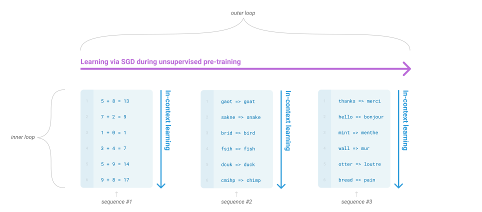

语言模型（LLM）的发展伴随着自然语言处理技术的不断进步，从早期的统计方法到如今的大规模预训练模型，其能力不断提升，推动了人工智能在语言领域的广泛应用。

1. **早期**使用统计语言模型（如 n-gram）进行建模，但上下文长度受限，难以捕捉长距离依赖。
2. **循环神经网络（RNN）及 LSTM**等神经网络方法提升了长距离依赖的建模能力。
3. **Transformer 模型**通过自注意力机制实现全局上下文建模，并支持大规模并行计算。
4. **大规模预训练模型**（如 GPT-3 和 BERT）结合**微调技术**，在多任务和多场景下展现卓越性能。

**LLM的分类与常见优势**

LLM从不同角度可以进行不同的划分，常见的划分如下图所示：

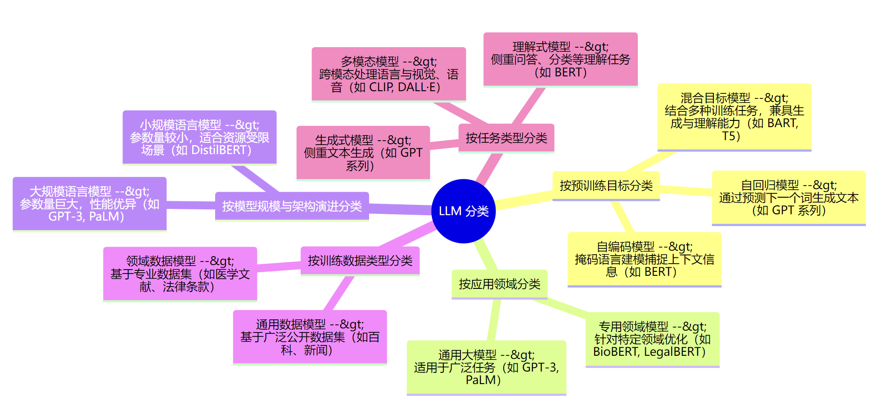

LLM（大规模语言模型）也具有一些显著特点和优势，以下我们基于项目目标列举了LLM的以下优势。

1. **深度语义理解与模式提取**  
LLM凭借其**强大的语义理解能力**，能够对海量内存使用历史数据进行深入分析，从中挖掘出潜在的使用模式和关键数据特征。这种能力不仅帮助系统精准识别内存负载的波动趋势，还能定位系统运行中的瓶颈区域，为优化策略的制定提供了科学的数据支撑。传统的内存管理方法往往依赖于固定规则和人工设定的阈值，而LLM通过对复杂数据的模式识别与规律总结，显著提升了分析的深度与精度，使得系统能够更高效地适应不同场景下的资源需求。

2. **自适应的策略生成与实时决策支持**  
LLM在上下文关联与推理能力方面的优势，赋予了系统根据实时状态动态生成优化策略的能力。借助LLM，系统能够**灵活地调整内存分配与回收方案**，针对复杂多变的运行环境提供智能化的决策支持。与传统方法相比，这种自适应的策略生成方式不仅更加灵活，还能有效减少资源浪费，提升系统整体性能和内存利用效率。这种能力特别适用于高并发、高动态负载的场景，为复杂系统的内存管理提供了一种全新的解决思路。

3. **高效的异常检测与风险预警**  
在内存管理中，**及时发现异常状态**是保障系统稳定性的重要环节。LLM通过对内存数据的深度分析，不仅能够识别常规的内存需求模式，还能敏锐捕捉到数据中的异常信号。通过对潜在风险的提前预警，系统可以及时采取措施，避免问题进一步扩散。这种预测性分析能力显著降低了故障发生率，为系统的稳定运行提供了可靠保障。相比传统的被动响应机制，LLM的异常检测与预警功能使得内存管理从“事后补救”转向“事前预防”，有效提升了系统的容错能力和运行效率。

4. **传统管理方式的智能化升级**  
通过引入LLM，内存管理从传统的规则驱动模式向智能化、动态化的方向迈进。LLM在数据处理、策略生成、异常预警等多个环节中展现出了显著的优势，不仅优化了资源调度效率，还推动了内存管理技术的革新。例如，在高负载环境下，LLM可以快速应对复杂的内存需求变化，避免了传统方法因局限性而导致的性能瓶颈问题。与此同时，其强大的扩展能力使得内存管理系统能够不断适应新场景、新需求，从而为全面提升系统性能奠定了技术基础。

综上所述，LLM在内存管理优化中展现了深度语义理解、动态决策、自适应优化和异常预警等多方面的优势。这不仅推动了传统内存管理方式的智能化升级，还为开发高效、稳定的内存调度机制提供了强有力的技术支持。通过这种方式，系统能够实现**更高的资源利用率、更低的故障率以及更强的环境适应能力**，为复杂计算环境中的内存管理带来了全新的突破和可能性。

#### 2.3.2 KVCache

**KVCache（Key-Value Cache）**是Transformer架构实现自回归生成时常用的一种缓存机制，它主要保存了在前向传播过程中计算出的各个Transformer层中注意力机制所用到的键（Key）和值（Value）张量。下面我们详细介绍KVCache的概念、其与LLM的关系以及相关的技术资料。

##### 1. KVCache的定义

参考 Wikipedia 上对 Transformer 模型的描述，**KVCache** 指的是在 Transformer 模型的自注意力机制中，为了加快自回归（autoregressive）生成过程而缓存之前计算过的 Key（键）和值（Value）向量的机制。在模型推理时，每个新生成的 token 只需计算与该 token 相关的 Query（查询）向量，而之前得到的 Key 和 Value 矩阵可以直接复用，这样避免了对整个序列重复计算自注意力，从而大幅度提高了生成效率。

在大规模语言模型（LLM）中，如GPT系列、PaLM等，模型通常采用自回归生成文本。KVCache正是这类模型在推理过程中提高速度和降低计算资源消耗的重要手段。具体表现为加速推理、降低计算资源需求、实现长上下文处理等。

##### 2. KVCache本身存在的问题

KVCache 在提升 Transformer 自回归生成效率方面具有重要作用，但同时也存在一些问题和挑战：

1. **内存消耗与增长问题**  
KVCache 的主要任务是保存已计算的 Key 和 Value 向量，当生成文本的序列较长时，缓存的大小将随 token 数量线性增长，导致内存占用越来越高。这在长文本生成或者需要大量并发推理的场景下可能严重影响系统性能。

2. **计算与索引效率**  
在实际推理过程中，KVCache 需要在每一步生成中高效地检索和整合历史信息。如果缓存数据结构设计不合理，检索效率低下或者数据更新操作繁琐，都会影响整体生成速度。

3. **缓存失效与一致性问题**  
在某些动态调整策略下，缓存中的信息可能与当前状态不匹配（例如模型参数更新、局部上下文变化等情况下的缓存失效问题）。这种不一致可能导致生成效果降低。

4. **与 Beam Search 和多样本生成的兼容性**  
对于 Beam Search 或其它复数候选输出模式，缓存更新和共享可能变得更加复杂，因为不同生成路径之间可能存在差异，如何高效复用缓存成为难题。

总体来说，KVCache 在提升自回归生成效率方面有显著作用，但在内存管理、计算效率、一致性和多候选生成等场景上仍存在挑战。

### 2.4 vLLM

**vLLM** 是一种**专为大规模语言模型（LLM）推理设计**的高性能引擎，其目标是在保证生成质量的前提下，显著提升推理效率和内存利用率。与传统推理框架相比，vLLM 在内存管理、动态批处理以及 KV cache 的高效复用等方面进行了多项优化。这使得 vLLM 能在面对海量请求和复杂模型时更好地发挥资源优势。

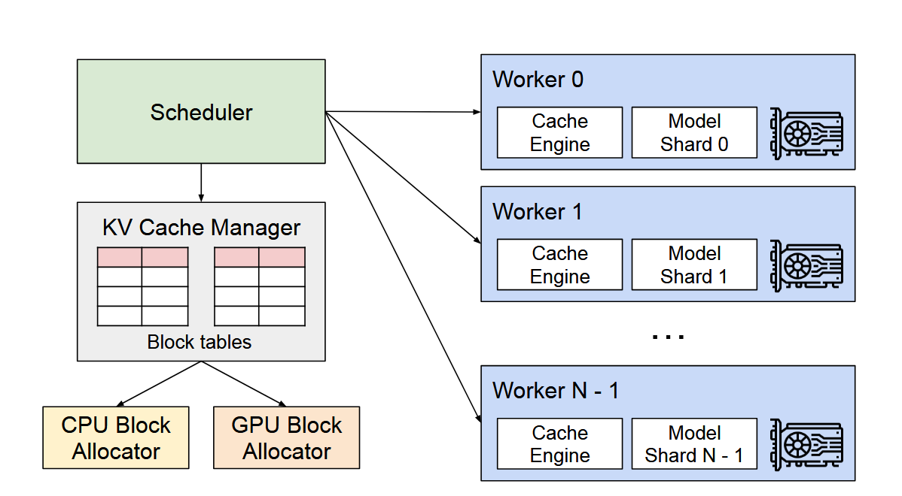

在原理上，vLLM 的核心优化包括：

**1. 动态批处理与调度**  
vLLM 通过动态批处理技术，将多个推理请求聚合处理，充分利用 GPU 或其他硬件的并行能力，从而降低单请求的延迟。同时，调度器会根据请求的相似性和时序关系智能安排计算顺序，避免硬件资源的闲置与过度调度。

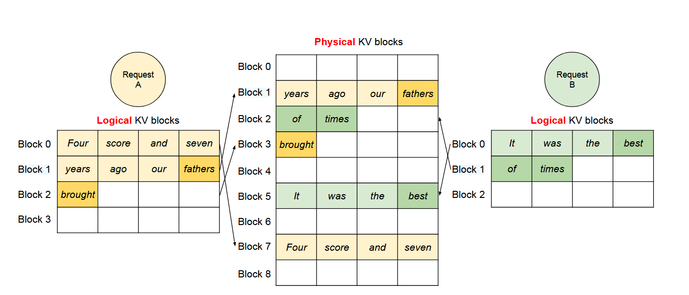

**2. 高效 KV cache 管理**  
在自回归生成中，KV cache 用于保存历史生成过程中的 Key 和 Value 向量，但长序列生成可能导致内存占用激增。vLLM 通过以下方式优化 KV cache：

- 使用内存压缩与分级存储结构，对不活跃的数据进行压缩存储；
- 利用智能缓存更新策略减少冗余存储和重复计算；
- 在动态批处理中复用缓存信息，减少每个请求的内存和计算开销。

从下图可以看到，vLLM 平滑了现有系统中看到的 KV 缓存内存的快速增长曲线，从而显著提高了服务吞吐量。

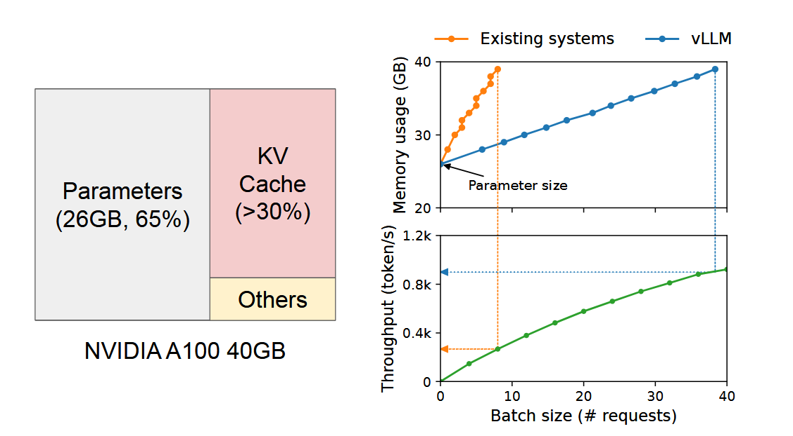

**3. 内存管理优化**  
vLLM 采用精细化的内存管理机制，包括内存池化和分级分配策略，提升了推理过程中的内存利用率。通过实时监控和释放内存，vLLM 能有效降低内存碎片和泄露风险，在大规模推理任务中表现出色。

vLLM 的这些设计在我们项目中的必要性主要体现在以下几点：

- **高效推理能力**  
vLLM 的动态批处理机制可显著加速推理过程，满足高并发场景中对低延迟和高吞吐量的需求。

- **内存优化优势**  
我们项目聚焦于内存优化，vLLM 的精细化 KV cache 管理和内存分配策略能够有效解决长序列生成带来的内存激增问题。

- **灵活扩展**  
vLLM 作为开源项目，具备良好的灵活性和可扩展性，支持根据项目需求进行定制化优化。其监控接口与优化方案为动态调整内存分配提供了技术支持。

总结来说，vLLM 是一款以高性能与内存高效为主要目标的推理引擎，其动态调度、高效 KV cache 管理以及精细化内存管理机制与我们项目的需求高度契合。通过引入 vLLM，我们可以在保证生成质量的同时，有效降低内存占用和延迟，提升系统的性能与扩展性。

### 2.5 RNN与LSTM

#### 2.5.1 神经网络
神经网络（neural network，NNs），在机器学习领域中，是一种模仿生物神经网络的结构和功能的数学模型或计算模型，用于对函数进行估计或近似。神经网络通常是通过一个基于数学统计学类型的学习方法得以优化，如对多层神经网络进行**梯度下降**的**反向传播算法**。

#### 2.5.2 循环神经网络
循环神经网络（Recurrent neural network，RNN），是神经网络的一种，适用于处理带有时间序列结构的信息输入。

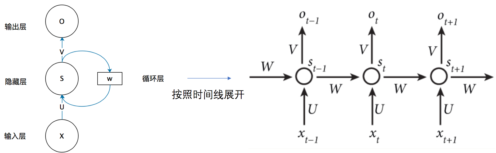

如图，隐藏层 $s_t$ 的值不仅仅取决于输入 $x_t$，还取决于 $s_{t-1}$。可以用以下公式描述
$` s_t = f(U\cdot x_t + W\cdot s_{t-1}),\\o_t = g(V\cdot s_t). `$
从而RNN可以结合历史序列信息计算当前输出。但当训练长时间序列的模型时，权重的多次迭代可能会导致梯度爆炸或梯度消失，导致难以通过梯度下降算法对模型参数进行优化。

#### 2.5.2 长短期记忆网络
长短期记忆网络（Long Short-Term Memory，LSTM）是一种循环神经网络，不仅克服了标准RNN训练时碰到的梯度爆炸/消失难题，也更有能力处理具有长期依赖关系的信息。
所有循环神经网络都具有神经网络重复模块链的形式。在标准RNN中，此重复模块将具有非常简单的结构，例如单个tanh层。
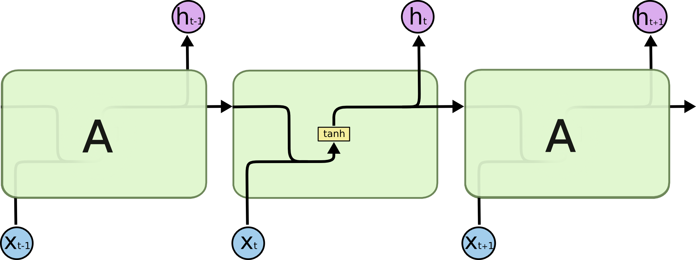
LSTM也具有这种链式结构，但重复模块的结构不同。它不是只有一个神经网络层，而是有四个，并以特殊的方式相互作用。

LSTM的关键是细胞态，即贯穿图表顶部的水平线。细胞态沿着整个链笔直运行，只有一些微小的线性变换。信息很容易不加改变地沿着它流动。

LSTM通过三个称为**门**的结构调节细胞态中的信息。
LSTM的第一阶段是称为**遗忘门**的结构，负责决定从细胞态中“遗忘”多少信息。

第二阶段决定要在细胞态中储存哪些新信息，称为**输入门**。

然后就可以把细胞态中的信息更新。

最后一个阶段是负责输出的**输出门**。

通俗地说，LSTM中的长期记忆就是细胞态中的信息，短期记忆就是标准RNN中也有的在相邻重复模块间的信息传递。
LSTM这种长短期记忆相结合的神经网络恰适用于通过输入操作系统调用的设备进程时间序列信息，来预测用户未来的行为，通过预加载资源等方式优化用户体验。

## 3 立项依据

在项目背景的基础上进一步深入调研。

### 3.1 AI与OS的交互

我们的原始目标是利用LLM预测并优化OS的内存管理，其中一种相对可行的粗粒度管理方案是，利用LLM的推理能力，预测用户文件系统层次的操作，从而优化内存管理。不论最后如何实现，这一过程都包含了用户、操作系统、LLM三者之间的交互，在深入分析其中的信息流和控制流之前，我们需要确认AI与操作系统交互的可行性。经过一周的文献调研，接下来我们将从现有的工作出发，分析AI与OS的交互模式，寻找可以借鉴的地方，为我们建立自己的研究范式做准备。

对于电脑端，目前AI与操作系统的交互主要有两种模式：

*  智能体应用（AI/LLM-based agent）作为应用程序或服务

*  AI 与 OS 融合 

而对于移动端，虽然难以直接部署本地智能体，但也出现了许多模型优化使用体验的尝试。

  

#### 3.1.1 智能体应用与AIOS

LLM 强大的推理和规划能力促进了基于 LLM 的代理的发展，包括单代理应用程序和协作多代理应用程序。在这种模式中，智能体（Agent，也译作代理）被视为操作系统中的一个应用程序或服务，通过API接口与操作系统交互。按照部署方式，分为 **“外挂式”和本地AI应用**。前者如微软Windows Copilot，虽然能提供一定的智能服务，但其未能与系统深度融合，无法直接访问系统深层数据，已被降级为渐进式网络应用程序（PWA）；如果开放访问系统深层数据，又涉及安全问题，所以外挂式AI虽然落地快，但不利于长期发展，阻碍人工智能技术与操作系统的深度融合。

随着个人电脑的算力提升、模型优化和开源，**本地部署并调用用户个人的智能“助理”**是智能体应用的趋势。如旅行智能体，根据用户输入的大概行程，可以结合用户偏好、天气预测，快速浏览大量的票务、酒店信息，个性化安排旅程。

智能体将任务分解后，需要与 LLM 服务（例如，检索和了解用户偏好、决定调用哪个工具 API、生成评论和回复）和传统OS服务（例如，访问磁盘驱动程序和执行软件）进行交互，这催生了新的问题，如：

* 如何在有限的LLM资源中安排代理请求并确定其优先级
* 上下文较长时，LLM的生成过程非常耗时 (time-intensive)，甚至会暂停生成，能否在LLM尚未完成生成时，设计一种机制来对 LLM 的当前生成结果进行快照（snapshot），从而启用 pause/resume 行为？
* 多个代理的并发作需要一个强大的操作系统来跨不同代理进行内存管理，确认调用工具的最佳顺序，同时还要确保严格执行隐私和访问控制措施。

上面的问题可以对应到传统操作系统的各个模块，需要对它进行革新。基于上面阐述的智能体应用的愿景，Rutgers University的团队初步设计了服务于智能体应用的AIOS，并逐步付诸实践。

##### 3.1.1.1 AIOS基本架构

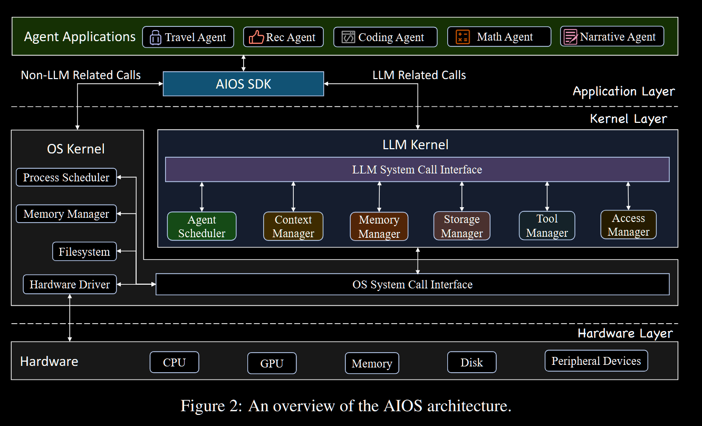

AIOS系统由两个核心组件构成：AIOS内核和AIOS SDK。

AIOS内核作为操作系统内核之上的抽象层，负责管理代理所需的各种资源，模仿传统OS进行了模块划分，每个部分**暂时挪用传统OS相关算法，且都需要单独验证和优化**。

AIOS SDK专为代理用户和开发者设计，通过与AIOS内核交互，使他们能够构建和运行代理应用程序。

这个项目完全开源，并欢迎一切完善AIOS生态的工作。下面我们跟进AIOS团队2025年发表的新进展。

##### 3.1.1.2 基于LLM的语义文件系统（LSFS）

**传统的文件系统系统**主要依赖文件属性（大小、创建和修改时间戳）来构建元数据，实际文件内容存储为二进制数据，利用索引结构（如 B+ 树）来有效定位这些数据。它无法在自然语言上下文中利用高级语义含义。例如，如果两个文件具有相似的内容，无法通过简单的字符串匹配来区分，则传统的文件系统无法根据内容相似性组织或检索这些文件。

同时，**用户与传统文件系统的交互**需要复杂的操作系统命令或手动导航，迫使用户精确调用文件名或位置。对于具有大量文件的系统，此检索过程可能效率低下且耗时。

为了解决这些限制，为AIOS社区提供通用的语义文件系统，他们构建了**基于 LLM 的语义文件系统 （LLM-based Semantic File System, LSFS）**，作为传统文件系统之上的附加层运行，充当代理/用户和传统文件系统之间的桥梁，为 AIOS 提供**提示词驱动（prompt-driven）的文件管理**服务。**LSFS目前已经作为终端UI集成到AIOS。**他们的工作可总结如下：

* 基于语义的索引结构：利用了一种轻量级的嵌入模型，即矢量数据库中常用的all-MiniLM-L6-v2，通过从文件内容中提取语义特征并生成相应的嵌入向量，用**向量数据库**存储文件，并将语义信息整合到文件操作中。

* **Syscall和API调用**实现文件操作：模仿传统文件系统功能为 LSFS 设计了许多可复用的系统调用接口(reusable syscall interfaces); 设计了多个 API，可基于 syscall 实现复杂的文件功能。LSFS利用**分层架构**，将 LSFS API 和 LSFS 系统调用隔离起来，这样 API 就可以专注于与自然语言提示词保持一致，而 LSFS 系统调用则专注于与文件和数据库的底层操作保持一致。同时允许扩展功能并支持基于该系统的未来开发。

* 简化用户与系统之间的交互：将 LLM 集成到复杂函数的 API 中构成**LLM解析器（Parser）**，并引入了系统提示词模板(template system prompt)。LLM 从用户输入的自然语言中提取关键字，并将它们有效地映射为 API 调用或系统调用。

* 容错机制和安全检查：防止LLM幻觉造成损失，LSFS监管者(Supervisor)负责监控传统文件系统中的更改并将其与LSFS实时同步。同步机制与回滚机制相结合，同时设置不可逆操作的安全检查和指令执行前的**用户验证**。

  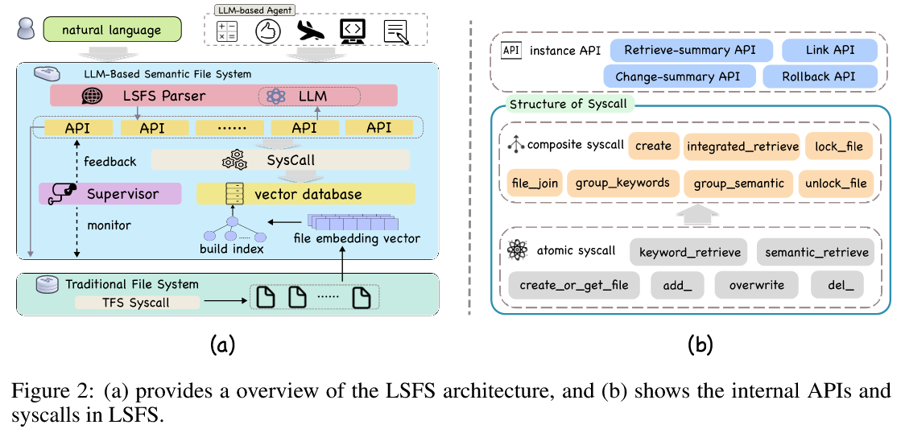

团队在设置了安全检查的条件下，首先验证了自然语言经过LSFS解析器（在不同LLM骨架上）转换为对应API或系统调用的准确性，平均解析准确率达90%；接着让同样的LLM执行语义检索任务，与传统文件系统相比，在LSFS中执行的检索准确率提高至少15%，检索速度提高了 2.1倍，这是因为LSFS的向量匹配代替了冗长上下文；最后比较了 LSFS 和传统文件系统在基于关键字的文件检索任务（字符串匹配）中的表现：`grep`命令只能处理纯文本文件，所以团队构建了其加强版本`TFS-grep`和`TFS-grep*`，以处理二进制文件，构建过程十分复杂，产生的结果也不稳定，需要用户做更多的手动筛选，但LSFS 可以检索所有类型的文本文件，同时保持高精度和召回率。此外，LSFS 支持更高级的文件管理操作，如语义文件回滚（rollback），即回到用户请求的版本。

论文结尾给出的未来工作方向有 **1）** 目前LSFS主要支持文本文件操作，未来可以扩展到多模态、多扩展名的文件管理， **2）** 探索数据加密技术来保护 LSFS 和 LLM 之间的数据交互和传输，确保在处理和通信的所有阶段都保护文件隐私， **3）** 检索算法优化， **4）** 扩展API和系统调用

存储方式改变后内存开销会不会太大？内存管理是否也需要适应性的优化？AIOS下的几篇文章都较少关注底层操作系统或底层的内存管理机制，下面他们针对智能体记忆开发的知识系统也是基于向量数据库实现。

##### 3.1.1.3 智能体记忆内存（A-MEM）

为了保持与外界环境的长期交互能力，智能体需要记忆——内存系统来利用历史经验。现有的LLM智能体记忆系统存在几个关键限制：**1）缺乏复杂的记忆组织**：当前系统仅提供基本的存储和检索功能，组织结构不够灵活,**2）固定的操作模式**：需要开发者预先定义记忆存储结构、指定工作流程中的存储点和检索时机，**3）适应性有限**：在不同任务间泛化能力差，难以维持长期有效的交互。

为了提升智能体在复杂、开放式任务需要的**灵活的知识组织和持续适应能力**，AIOS团队开发了名为**A-MEM（Agentic Memory）**的新型主动式记忆系统，基于[Zettelkasten](https://zhuanlan.zhihu.com/p/299377905)方法（一种知识管理系统），通过动态索引和链接创建互连的知识网络让LLM智能体动态组织记忆。

新的交互事件发生后，将会进行下面三个过程：（具体建模省略）

* **笔记构建 (Note Construction)** 期间，系统会将新的交互记忆构建为结构化的**笔记**，包含捕获的显式信息（原始内容、时间戳）和 LLM 基于上下文生成的语义理解（关键词、分类标签、上下文描述）。

* **链接生成（Link Generation）** ，新的笔记进入系统后，A-MEM首先会根据其语义检索最相关的k个历史记忆（记作$`\Mu ^n _{near}`$），然后语言模型会决定是否在它们之间建立连接。A-MEM利用了现代语言模型识别细微的模式、因果关系和概念联系（而不仅分析嵌入向量的相似性），实现自然自动的知识组织，无需预先定义规则。

  图中“盒子”的概念描述了相关的记忆通过它们相似的上下文描述（contextual description）变得相互关联，类似于 Zettelkasten 方法。然而，A-MEM的方法允许个人记忆同时存在于多个不同的盒子中。

*  **记忆演化（Memory Evolution）** 为新记忆创建链接后，A-MEM 会更新$`\Mu ^n _{near}`$中的记忆，根据文本信息和与新记忆的关系，决定是否更新其笔记中的语义理解。

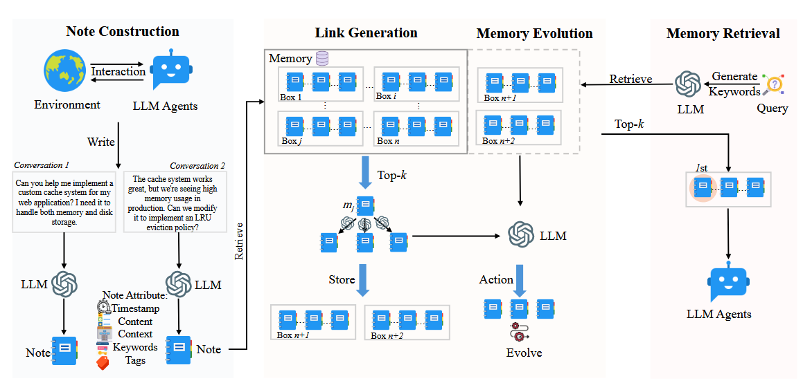

经过上面三个过程，智能体完成了一次主动记忆，当用户再次调用时触 发**记忆检索（Memory Retrieval）** 将用户查询转换为向量表示，检索最相关的历史记忆，将这些记忆作为上下文添加到LLM的输入中。

A-MEM作为独立的记忆管理系统，存在于LLM智能体之外，通过API调用方式与LLM进行交互，利用其推理能力来管理记忆，而不是直接嵌入或微调大模型本身，因此适用于计算资源限制的实际应用场景。LLM的记忆管理（ **Memory for LLM Agents** ）是一个单独的领域，过往不同的工作采用了不同的数据库结构。虽然应用场景存在一定差别——我们课题下的工作场景是预测用户行为，与真实世界的交互有限，所以任务的复杂、开放程度更低——但LLM的记忆管理系统为我们提供了数据库的思路，虽然与理想中大模型持续学习机制有一定距离，但可以提高MEMO的持续适应能力。

#### 3.1.2 模型原生操作系统 (Model-Native OS)

这是一种更前沿的方法，通过"模型-系统-芯片"的全栈协同设计，构建针对AI模型优化的操作系统。与AIOS相比，更加强调OS与模型的融合，其特点包括：

1.  **智能交互范式** ：重塑用户与系统的交互方式，从直接面向用户转向以智能体为中介的交互模式，并需要解决UI理解、交互逻辑动态化和跨应用智能服务等挑战。
2.  **创新系统抽象接口** ：引入智能化抽象，支持从简单命令到复杂需求的灵活表达，并通过多层次系统服务接口平衡智能应用与系统实时性。
3.  **系统内生智能** ：构建操作系统级别的通用基础模型，实现跨应用智能协作，提供系统级智能体服务，建立 **持续学习机制** 满足多样化智能需求。
4.  **智能知识存储** ：从面向数据转向面向知识的存储设计，通过软硬协同和跨应用数据互通，提升模型在复杂场景下的智能表现。
5.  **高效算力供给** ：在模型、系统和硬件多个层面优化，包括模型轻量化、高效推理、计算卸载和异构计算架构等，以平衡算力、内存、功耗与智能水平。
6.  **系统安全可靠** ：实现数据和模型全生命周期保护，构建可信AI软件栈，并通过内生安全审计机制提升模型行为的确定性和可靠性。

这种方式或许是AIOS的最终形态，但还处于0.5（很接近于0）阶段，如LLM的可解释性与持续学习机制、异构算力整合都是时下热门领域。考虑到小组作业的局限性，我们按下不表。况且AIOS中的工作也在融合传统OS与模型特性，这两种交互模式并非独立。

#### 3.1.3 移动端的AI优化OS尝试

* Google Now / Google Assistant：通过分析用户日程、搜索、位置数据提供“预测性卡片”，但模型粒度不够个性化，无法基于本地应用行为细粒度预测。
* Apple Siri Suggestions：能基于近期 App 使用习惯进行建议，但其模型为黑盒，无法在本地个性化训练或嵌入微调机制。

### 3.2 利用LLM与LSTM预测用户程序调度

​        在宏观层面上分析了AI、OS与用户三者之间的关系后，我们从文件系统操作预测（主要考虑软件应用预测）维度展开了调研。我们发现这一工作自从2009年开始，Verkasalo就通过**上下文** （时间和地点）分析的方法，在一定程度上实现了用户软件的预测[18]。每一次该领域出现进的进展，大多是由于预测方法的改进。据我们的调研显示，最近的一次方法革新出现在2017年[13]。神经网络的发展，尤其是RNN神经网络的出现，极大地改善了预测的精确性。

​        在几年的时间内，人工智能出现了翻天覆地的变化，算力的提升与模型的优化已经为AI与OS结合创造了可能性。据此，MEMO小组想在前人工作的基础上进一步探索如何将软件预测机制与Linux内存管理交叉融合。我们首先介绍选择这一项目的意义和原因，然后按照时间顺序分析该领域的前期研究成果。

#### 3.2.1 传统操作系统内存管理 vs LLM赋能新型内存管理

#####  **规划内存**

​	在传统智能调度机制下，操作系统可能无法合理预测应用程序的需求。例如，当一个用户在系统中频繁使用某个应用程序时，操作系统并不提前为其预留足够的内存。这可能导致应用程序启动时资源竞争，从而出现启动延迟或应用卡顿。相比之下，智能调度系统可以根据历史数据和用户行为模式提前预测用户的需求，并提前为可能被打开的应用程序预分配内存资源。这样做能显著减少启动时间和提高响应速度。

#####  **合理分配资源**

​	在多任务处理时，系统可能会低估或高估某些应用的资源需求，造成资源过度分配或资源饥饿，即任务之间无法平衡分配，最终影响整体系统性能。通过智能调度，系统能够根据实时和历史行为调整任务优先级，避免多个任务争夺相同的资源，减少系统负载和资源瓶颈。

####  3.2.2 优化角度：粗粒度预测与微秒级实时性的平衡

> [!IMPORTANT]
>
> 在我们的调研过程中，我们意识到虽然AI和机器学习模型在资源调度领域具有巨大的潜力，但它们在进行**细粒度调度**时面临一些挑战。我们曾经设想直接利用模型来优化内存管理中的具体细节，如分页机制等，这一想法最终被否定了。具体原因为操作系统的调度任务通常是**微秒级别**进行的，这要求操作系统能够实时地进行快速决策和执行。然而，当前的 AI 模型（尤其是基于深度学习和预测的模型）在处理调度任务时，通常需要**秒级别的时间**来进行计算和推断，这与操作系统对实时性要求存在较大差距。因此，使用 AI 来直接进行**微观层次的预测**（如 CPU 时间片分配、内存页调度等）可能导致系统响应延迟，从而影响操作系统的稳定性和实时性。
>
> 鉴于此，我们选择将 AI 模型的应用范围限制为**粗粒度的调度任务**，具体指针对用户打开软件的需求预测。在这个场景下，系统并不需要在微秒级别上对每个任务进行精细的资源管理，而是可以在秒级别的时间窗口内做出预测和决策。例如，预测用户在某段时间内可能打开哪些应用程序，并根据预测结果提前分配资源、进行预加载等。这种粗粒度的调度不仅能够有效地利用 AI 的预测能力，同时也避免了 AI 模型在实时性要求极高的操作系统任务中可能带来的延迟和风险。

#### 3.2.3 前期工作的研究方法

该领域早期研究方法主要基于原生的概率模型。直到2017-2018年，由于神经网络的快速发展，LSTM的方法成为了主流趋势。在大模型日趋成熟的当下，我们计划对原有的LSTM神经网络进行进一步的优化，从而实现更准确的用户软件预测和更加合理的内存资源调度。

##### 早期研究

##### 上下文分析 (Contextual Information): 

> 上下文分析指的是通过**环境因素**例如包括时间、位置、WiFi 信号、电池使用情况等一系列信息对用户的软件使用行为进行预测的方法，其中**时间**和**地理位置**对预测有至关重要的决定性因素。**在调研过程中，我们还发现针对手机软件预测的研究较多，而针对PC进行软件预测的研究则相对较少**，**这很有可能是由于上下文信息在手机上容易获取，但在电脑上获取较为困难导致的**[18]。

##### APPM 算法

> APPM算法是一种**模仿文本压缩算法PPM**的预测应用算法。PPM算法的核心思想为**通过字符的前缀来推测后续的字符**，从而实现压缩的功能。同样地，**APPM算法将“程序”看做“字符”，将用户使用程序的时间序列看作字符串**。通过用户当前使用的程序来预测后续将要使用的程序。与PPM算法不同的是，在字符序列中，往往长度最长的字符串与整个字符具有最强的相关性。然而，在用户的应用使用过程中，短的前缀和长的前缀可能是同等重要的。例如，研究者发现在某些情况下，用户倾向于强烈偏爱最近使用的项目；而在其他情况下，用户的使用序列表现出高度连续的软件使用行为[16]。下图展示了APPM算法与PPM算法的比较。
>
> 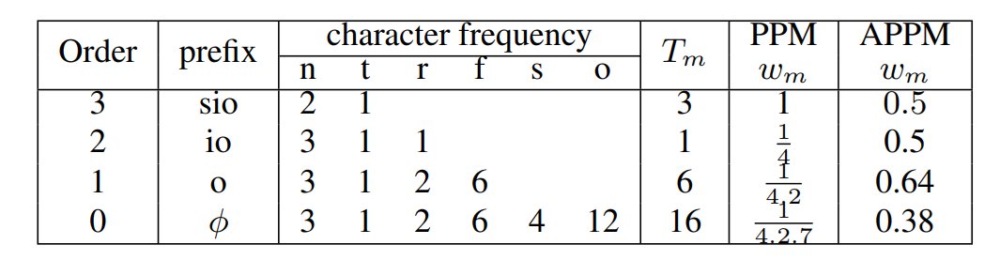

​     

##### PTAN(Parallel Tree Augmented Naive Bayesian Network)  

> PTAN是一种应用程序预测模型，**它的任务是根据用户的历史行为（如应用程序的使用时间、位置等）预测用户在下一个时间段内最可能使用的应用程序**。提出者将此任务建模为**分类问题**，并通过结合上下文信息和历史数据来实现个性化预测。研究者首先获取用户的应用使用记录，。然后提取这些数据中的上下文信息和会话特征（应用程序之间的时序关系）[17]。
>     
>  研究者将应用分为**短期应用和长期应用**。在分类方法上，他们通过拟合应用程序使用数据到 Beta 分布，从而评估应用的时间显著性（即其使用的短期性或长期性）。**短期应用**指使用频率较高的应用，预测时采用**基于用户历史行为的概率**。**长期应用**则通过 "**集体智慧**" 来推测预测概率，即基于其他用户的数据进行初步预测。因为对于长期应用来说，使用贝叶斯平均将用户的历史行为与其他用户的平均行为数据结合能得到更准确的预测[17]。
>
>  PTAN也考虑了**应用冷启动** 和**用户冷启动**问题，并提出了两种策略：
>
> 1. 应用冷启动主要针对新安装的应用，算法基于**其他用户的数据**估计其初步的使用概率，并随着用户使用频率增加逐步调整。
> 2. 用户冷启动则主要针对新用户，研究者采用了最相似用户策略和伪用户策略来预测他们的行为模式。最相似用户策略指通过找到与新用户最相似的用户，并借用他们的行为模式进行预测。伪用户策略指通过生成“伪历史”来训练模型，为新用户构建合适的初始数据。

   

> [!IMPORTANT]
>
> 这些早期的方法均存在着同样的缺陷，即它们都忽略了应用程序使用的时间序列依赖性，未能有效捕捉历史信息揭示的长期模式。具体来说，早期的方法主要是一些**概率模型**。这些方法依赖于用户行为的**统计特征**（如使用频率、应用间的关联等），并假设每个时刻的行为是相对独立的，即**条件独立假设**。然而，这种假设无法有效**捕捉应用程序使用的时间序列依赖性**，即一个用户的当前使用的app，可能与过去一段时间内的行为存在深刻的关联。随着神经网络的迅猛发展，新的预测方法逐渐取代了原生的概率模型，成为更加主流的预测方法。

##### 热门方向 

##### **递归神经网络 (RNN**) & 长短期记忆网络（LSTM）

###### RNN神经网络

> [!IMPORTANT]
>
> ​       RNN（循环神经网络）是一种可以处理**序列数据**的神经网络，适用于**时间序列预测、语音识别、自然语言处理**等任务。<u>RNN的特点是网络中的节点不仅接收来自前一层的输入，还会接收来自上一个时间步的输出，这使得它能够捕捉到序列中的时间依赖关系</u>[12]。

######  RNN神经网络与标准神经网络的区别

> [!IMPORTANT]
>
>  RNN（循环神经网络）与传统神经网络的主要区别在于其结构和处理数据的方式。**传统神经网络**（如前馈神经网络）主要处理**固定大小的输入数据，每次计算的输出仅依赖于当前输入**。**RNN**则能够处理序列数据，其结构设计**允许当前的输出不仅依赖于当前的输入，还与之前的输出（或状态）有关**。通过这种方式，RNN能够捕捉数据中的**时间依赖性或序列特征**[12]。
>
> 相比之下，传统神经网络不能直接处理序列数据，因为它们缺乏记忆能力，无法记住先前的输入状态。而RNN通过在网络中建立“反馈”连接，能够存储并使用先前的信息，因此在处理动态时间序列或具有时序特征的数据时，RNN更为有效。   

###### LSTM：RNN的强化版

> [!IMPORTANT]
>
>  LSTM是RNN神经网络的增强版本，为了解决标准的RNN在处理长时间依赖关系时会遇到的梯度消失或爆炸的问题。LSTM通过引入“记忆单元”来保留重要的信息，同时使用门控机制（输入门、遗忘门和输出门）来控制信息的流动[13]。这使得LSTM能够更有效地捕捉长时间跨度的依赖关系，并在处理复杂的时序任务时表现出色。下图是LSTM算法的工作原理图。
>
> 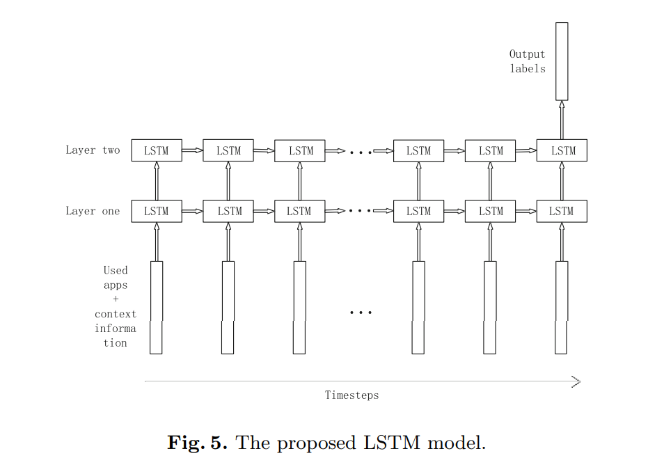

## 4 前瞻性/重要性分析

基于我们目前的调研情况，我们提出了以下可行的研究聚焦方向：

> [!NOTE]
>
> 1. 在原有通用模型的基础上，实现更加个性化的小模型，能够针对不同的用户，给出不同的调度方案,同时兼顾内存的合理调度与资源分配[13]。
> 2. 获取PC机上充足的上下文信息，从而能够实现PC机上更精准的预测[13]。
> 3. 尝试联合模型的方法提高软件应用的预测效果，比如VLLM结合LSTM的方法。

以下内容是对我们提出的所有思路进行前瞻新和重要性分析。

### 4.1 个性化小模型与内存调度的结合

#### 前瞻性

个性化小模型的实现是未来操作系统调度的一大发展方向。2017年，研究者曾基于sequence-to-sequence的神经网络方法完成过具有通用功能的软件预测实现，该研究成果对于所有具有序列特征的数据均有效，但随着用户行为多样性的增加，通用模型往往无法精确适配每个用户的需求。个性化的小模型能够根据用户的行为、应用习惯和偏好，**量身定制调度方案**，在提高 **用户体验** 的同时，优化 **资源分配**。

**内存的合理调度与资源分配** 是提高系统效率的关键问题。现代操作系统面临着日益复杂的 **多任务调度** 和 **高并发处理** 问题，尤其在 **内存管理** 上，传统的调度方法可能无法应对大型应用的需求。结合软件调度策略，引入 **个性化的调度策略** 可以有效避免内存资源的浪费或不足，从而提升操作系统的 **响应速度** 和 **稳定性**。

#### 重要性

- **提高内存管理效率**: 针对不同用户的需求提供个性化软件调度，能够避免全局资源调度的冲突和浪费，提高系统在内存和计算资源上的利用率。
- **增强用户体验**: 个性化的小模型不仅能够提升系统资源的管理效率，还能够根据用户的行为习惯优化应用的启动顺序、内存分配和任务调度，从而减少等待时间，提高响应速度。
- **节能和降耗**: 根据用户的实际需求进行内存和资源的合理调度，有助于避免不必要的资源消耗，降低系统的能耗。

### 4.2 获取PC机上的上下文信息进行精准预测

#### 前瞻性

在 **PC 操作系统** 中，获取更丰富的 **上下文信息**（尤其是时间和地点）是实现精确预测和智能调度的关键。以往基于PC机的软件调度往往由于物理条件限制，缺乏对上下文信息的深入理解[13]。而通过引入更多的 **上下文信号**（如用户当前的操作类型、所在位置、wifi信号等），可以让操作系统预测用户的下一步需求，从而动态调整调度策略。

随着 **IoT（物联网）** 和 **智能设备** 的普及，PC 系统将越来越能通过各种传感器和外部设备收集 **丰富的上下文数据**，这些数据能够显著提高系统对未来需求的预判能力。

#### 重要性

- **精确预测与资源优化**: 通过获取用户和设备的上下文信息，系统可以更加精准地预测用户的行为，提前做好内存和任务调度，减少延迟和资源浪费。
- **增强个性化与适应性**: 上下文信息可以帮助操作系统更好地适应用户的动态需求。例如，若用户正在进行高负载任务，操作系统可以优先分配更多的计算资源给当前任务。
- **提升多任务处理能力**: 在多任务环境下，基于上下文信息的调度可以有效管理任务的优先级，避免过度调度或资源冲突，从而提升多任务处理的稳定性和流畅度。

### 4.3 联合模型（LSTM与VLLM的结合）提高软件应用预测效果

#### 前瞻性

**LSTM（长短期记忆网络）** 和 **VLLM（Very Large Language Model）** 的结合是一种创新性的 **联合模型** 方案。LSTM 擅长捕捉时间序列中的长期依赖性，而 VLLM 是当前 **大规模语言模型** 中非常强大的工具，可以高效处理大规模数据和提取深层次的语义信息。

在 **操作系统调度** 领域， **LSTM** 可以帮助系统通过用户的历史行为数据预测未来的应用需求（例如，用户过去使用过的应用序列），而 **VLLM** 则能从 **大规模语言模型** 提供的强大理解能力中获益，辅助调度和预测算法通过 **自然语言处理** 技术捕捉用户行为的复杂模式。

**联合模型** 的优势在于它能结合 LSTM 强大的时间序列建模能力和 VLLM 的语义理解能力，从而在软件应用的预测中提供更加全面的解决方案。

#### 重要性

- **提升预测精度**: 结合 LSTM 和 VLLM，能够有效融合 **时间序列数据** 和 **语义信息**，使得软件应用的预测更加准确。例如，LSTM 可以预测用户在特定时间段的应用使用情况，而 VLLM 能结合上下文信息（如用户正在进行的任务类型、历史应用习惯等）提供更加智能的预测。
- **增强多维度特征建模能力**: LSTM 和 VLLM 的联合能够同时处理 **时序数据** 和 **复杂语义特征**，为操作系统提供更加综合的决策支持。VLLM 的预训练能力可以加速模型对多任务调度、资源分配等领域的学习。
- **提升系统智能化水平**: 通过使用大规模的语言模型，操作系统能够更加智能地识别 **用户需求模式** 和 **任务优先级**，自动调整内存分配、任务调度等，以达到高效资源利用和低延迟响应。

## 5 相关工作

### AIOS

开源项目，更多信息及最近新展见Github主页： [agiresearch/AIOS: AIOS: AI Agent Operating System](https://github.com/agiresearch/AIOS) 

2024.3  [AIOS: LLM Agent Operating System](https://arxiv.org/abs/2403.16971) 阐释了AIOS的基本架构，验证了多智能体应用并发的可行性和基本调度算法的可迁移性

2025.2 [From Commands to Prompts: LLM-based Semantic File System for AIOS](https://arxiv.org/abs/2410.11843) 基于LLM的语义文件系统，已整合进AIOS

2025.3  [A-MEM: Agentic Memory for LLM Agents](https://arxiv.org/abs/2502.12110) 新型主动式的智能体记忆系统，基于[Zettelkasten](https://zhuanlan.zhihu.com/p/299377905)方法、通过动态索引和链接创建互连的知识网络让LLM智能体动态组织记忆

2025-03  [Cerebrum (AIOS SDK): A Platform for Agent Development, Deployment, Distribution, and Discovery](https://arxiv.org/abs/2503.11444) 完善了AIOS SDK，设计智能体应用开发，与我们的课题关系较弱

### 软件预测的相关研究

1. 2009年，Verkasalo和Hannu提出了基于上下文信息分析的算法预测软件应用的思想。论文链接：[http://dx.doi.org/10.1007/s00779-008-0197-0](http://dx.doi.org/10.1007/s00779-008-0197-0)
2. 2013年，Parate, Abhinav 和 Bohmer, Matthias 和 Chu, David 和 Ganesan, Deepak 和 Marlin 和 Benjamin M.提出了APPM算法，将应用程序序列视作字符串、将应用程序视作字符，采用了类似于基于字符串前缀预测字符串的PPM算法，对用户的软件使用进行了预测。论文链接：[http://dx.doi.org/10.1145/2493432.2493490](http://dx.doi.org/10.1145/2493432.2493490)
3. 2015年，Baeza-Yates, Ricardo 和 Silvestri, Fabrizio 和 Jiang, Di 和 Harrison Beverly 提出了通过朴素贝叶斯分类器的机器学习模型对移动设备上的软件进行预测，从而省去了大量用户寻找软件花费的时间。论文链接：[http://dx.doi.org/10.1145/2684822.2685302](http://dx.doi.org/10.1145/2684822.2685302)
4. 2017年，Yang, Qichuan 和 He, Zhiqiang 和 Ge, Fujiang 和 Zhang, Yang 提出了sequence-to-sequence的基于PC的软件预测方法，他们的工作主要集中在优化LSTM模型。论文链接：[https://dx.doi.org/10.1109/IJCNN.2017.7965952](https://dx.doi.org/10.1109/IJCNN.2017.7965952)
5. 2018年，Xu, Shijian 和 Li, Wenzhong 和 Zhang, Xiao 和 Gao, Songcheng 和 Zhan, Tong 和 Zhao, Yongzhu 和 Zhu, Wei-wei 和 Sun, Tianzi 提出了基于LSTM模型在移动设备端预测用户软件使用的方法。论文链接：[[Predicting Smartphone App Usage with Recurrent Neural Networks | SpringerLink](https://link.springer.com/chapter/10.1007/978-3-319-94268-1_44?fromPaywallRec=false#Bib1)
6. 2023年，Liang, Yunji 和 Liu, Lei 和 Huangfu, Luwen 和 Wang, Zhu 和 Guo, Bin 将用户的兴趣划分为短期兴趣和长期兴趣，他们的研究主要聚焦在产生更加个性化的预测。论文链接：[http://dx.doi.org/10.1007/s11280-023-01161-3](http://dx.doi.org/10.1007/s11280-023-01161-3)

# References

1. Vaswani, Ashish, Shazeer, Noam, Parmar, Niki, Uszkoreit, Jakob, Jones, Llion, Gomez, Aidan N, Kaiser, Łukasz, Polosukhin, Illia. "Attention is all you need." *Advances in neural information processing systems*, vol. 30, 2017.
2. Shoeybi, Mohammad, Patwary, Mostofa, Puri, Ramesh, LeGresley, Patrick, Casper, Jared, Catanzaro, Bryan. "Megatron-LM: Training Multi-Billion Parameter Language Models Using Model Parallelism." 2019.
3. Dai, Zihang, Yang, Zhilin, Yang, Yiming, Carbonell, Jaime, Le, Quoc V, Salakhutdinov, Ruslan. "Transformer-XL: Attentive Language Models Beyond a Fixed-Length Context." *arXiv preprint arXiv:1901.02860*, 2019.
4. Dai, Zihang, Yang, Zhilin, Yang, Yiming, Carbonell, Jaime, Le, Quoc V, Salakhutdinov, Ruslan. "Transformer-XL: Attentive Language Models Beyond a Fixed-Length Context." *arXiv preprint arXiv:1901.02860*, 2019.
5. Rae, Jack W., Potapenko, Anna, Jayakumar, Siddhant, Hillier, Chloe, Lillicrap, Timothy. "Compressive Transformers for Long-Range Sequence Modelling." *arXiv preprint arXiv:1911.05507*, 2020.
6. Child, Rewon, Gray, Scott, Radford, Alec, Sutskever, Ilya. "Generating Long Sequences with Sparse Transformers." *arXiv preprint arXiv:1904.10509*, 2019.
7. Vaswani, Ashish, Shazeer, Noam, Parmar, Niki, Uszkoreit, Jakob, Jones, Llion, Gomez, Aidan N., Kaiser, Łukasz, Polosukhin, Illia. "Attention is all you need." *Advances in neural information processing systems*, vol. 30, 2017.
8. Li, Yafu et al. "Revisiting Cache Mechanisms in Neural Sequence Generation." *arXiv preprint arXiv:2106.12616*, 2021.
9. OpenAI. "OpenAI Blog / 技术报告中关于 Beam Search 与缓存管理的讨论." 2021.
10. vLLM Project. "vLLM: A high-throughput and memory-efficient inference and serving engine for LLMs." 2025. [https://github.com/vllm-project/vllm](https://github.com/vllm-project/vllm)
11. Kwon, Woosuk, Li, Zhuohan, Zhuang, Siyuan, Sheng, Ying, Zheng, Lianmin, Yu, Cody Hao, Gonzalez, Joseph E., Zhang, Hao, Stoica, Ion. "Efficient Memory Management for Large Language Model Serving with PagedAttention." *Proceedings of the ACM SIGOPS 29th Symposium on Operating Systems Principles*, 2023.
12. Knauerhase, R. et al. "Xu, Shijian, Li, Wenzhong, Zhang, Xiao, Gao, Songcheng, Zhan, Tong, Zhao, Yongzhu, Zhu, Wei-wei, Sun, Tianzi. "Predicting Smartphone App Usage with Recurrent Neural Networks." *Wireless Algorithms, Systems, and Applications*, 2018. Springer International Publishing, Cham, pp. 532-544. ISBN: 978-3-319-94268-1.[[Predicting Smartphone App Usage with Recurrent Neural Networks | SpringerLink](https://link.springer.com/chapter/10.1007/978-3-319-94268-1_44?fromPaywallRec=false#Bib1)
13. Yang, Qichuan, He, Zhiqiang, Ge, Fujiang, Zhang, Yang. "Sequence-to-sequence prediction of personal computer software by recurrent neural network." *2017 International Joint Conference on Neural Networks (IJCNN)*, 2017, pp. 934-940. DOI: [10.1109/IJCNN.2017.7965952](https://doi.org/10.1109/IJCNN.2017.7965952).
14. Liang, Yunji, Liu, Lei, Huangfu, Luwen, Wang, Zhu, Guo, Bin. "DeepApp: characterizing dynamic user interests for mobile application recommendation." *World Wide Web*, vol. 26, no. 5, 2023, pp. 2623-2645. ISSN: 1386145X. DOI: [10.1007/s11280-023-01161-3](http://dx.doi.org/10.1007/s11280-023-01161-3).
15. Xu, Shijian, Li, Wenzhong, Zhang, Xiao, Gao, Songcheng, Zhan, Tong, Lu, Sanglu. "Predicting and Recommending the next Smartphone Apps based on Recurrent Neural Network." *CCF Transactions on Pervasive Computing and Interaction*, vol. 2, no. 4, 2020, pp. 314-328. ISSN: 2524521X. DOI: [10.1007/s42486-020-00045-z](http://dx.doi.org/10.1007/s42486-020-00045-z).
16. Parate, Abhinav, Bohmer, Matthias, Chu, David, Ganesan, Deepak, Marlin, Benjamin M. "Practical prediction and prefetch for faster access to applications on mobile phones." *UbiComp 2013 - Proceedings of the 2013 ACM International Joint Conference on Pervasive and Ubiquitous Computing*, 2013, pp. 275-284, Zurich, Switzerland. DOI: [10.1145/2493432.2493490](http://dx.doi.org/10.1145/2493432.2493490).
17. Baeza-Yates, Ricardo, Silvestri, Fabrizio, Jiang, Di, Harrison, Beverly. "Predicting the next app that you are going to use." *WSDM 2015 - Proceedings of the 8th ACM International Conference on Web Search and Data Mining*, 2015, pp. 285-294, Shanghai, China. DOI: [10.1145/2684822.2685302](http://dx.doi.org/10.1145/2684822.2685302).
18. Verkasalo, Hannu. "Contextual patterns in mobile service usage." *Personal and Ubiquitous Computing*, vol. 13, no. 5, 2009, pp. 331-342. ISSN: 16174909. DOI: [10.1007/s00779-008-0197-0](http://dx.doi.org/10.1007/s00779-008-0197-0).emory Pool Optimization in High-Performance Computing." *High Performance Computing Journal*, 2019.
19. K. Mei *et al.*, “AIOS: LLM Agent Operating System,” Nov. 07, 2024, *arXiv*: arXiv:2403.16971. doi: [10.48550/arXiv.2403.16971](https://doi.org/10.48550/arXiv.2403.16971).
20. Z. Shi *et al.*, “From Commands to Prompts: LLM-based Semantic File System for AIOS,” Mar. 19, 2025, *arXiv*: arXiv:2410.11843. doi: [10.48550/arXiv.2410.11843](https://doi.org/10.48550/arXiv.2410.11843).
21. W. Xu, Z. Liang, K. Mei, H. Gao, J. Tan, and Y. Zhang, “A-MEM: Agentic Memory for LLM Agents,” Mar. 04, 2025, *arXiv*: arXiv:2502.12110. doi: [10.48550/arXiv.2502.12110](https://doi.org/10.48550/arXiv.2502.12110).
22. 陈海波, 夏虞斌, 陈榕《模型原生操作系统：机遇、挑战与展望》. 2025年4月2日. [在线]. 载于: https://www.secrss.com/article/76659
23. vLLM Project. (2025). *vLLM: A high-throughput and memory-efficient inference and serving engine for LLMs*. GitHub. Retrieved from <https://github.com/vllm-project/vllm>
24. Kwon, W., Li, Z., Zhuang, S., Sheng, Y., Zheng, L., Yu, C. H., Gonzalez, J. E., Zhang, H., & Stoica, I. (2023). *Efficient Memory Management for Large Language Model Serving with PagedAttention*. In *Proceedings of the ACM SIGOPS 29th Symposium on Operating Systems Principles*.
25. Dai, Z., Yang, Z., Yang, Y., Carbonell, J., Le, Q. V., & Salakhutdinov, R. (2019). *Transformer-XL: Attentive Language Models Beyond a Fixed-Length Context*. *arXiv preprint arXiv:1901.02860*.
26. Deepak, P. (2023). Tutorial: Beginners guide on Linux Memory Management. https://www.golinuxcloud.com/tutorial-linux-memory-management-overview/
27. Christopher, O. (2015). Understanding LSTM Networks. http://colah.github.io/posts/2015-08-Understanding-LSTMs/
