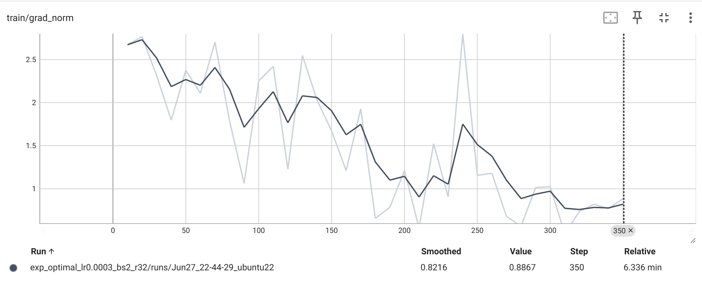

# fine-tuning调参记录

## 设备信息

Linux

GeForce RTX 4090 *2


Python 3.12.9


> 为了减少单个训练的时间，调参时只使用了部分数据集


## **第一轮 (实验1-10)：全面探索**

**目标**：确定关键超参数的大致范围

| 实验号 | 参数修改策略                    | 结果   | 结果分析                 |
| ------ | ------------------------------- | ------ | ------------------------ |
| exp1   | 基础配置 (lr=0.0002, bs=2, r=8) | 0.2989 | 建立baseline，表现良好   |
| exp2   | 降低学习率 (lr=0.0001)          | 0.2793 | 学习率过低，收敛不充分   |
| exp3   | 增大batch size (bs=4)           | 0.2877 | 大batch反而降低效果      |
| exp4   | 增大LoRA rank (r=16, a=64)      | 0.2709 | 中等rank效果一般         |
| exp5   | 提高学习率 (lr=0.0005)          | 0.2989 | 达到最优，学习率可以更高 |
| exp6   | 组合优化 (低lr+大bs+大r)        | 0.2793 | 多参数组合未带来提升     |
| exp7   | 增大dropout (d=0.2)             | 0.2709 | 过度正则化，效果下降     |
| exp8   | 梯度累积策略 (bs=1, gs=8)       | 0.2933 | 小幅提升，梯度策略有效   |
| exp9   | 极低学习率 (lr=0.00005)         | 0.2821 | 过于保守，效果中等       |
| exp10  | 大LoRA容量 (r=32, a=128)        | 0.2989 | 大容量达到最优水平       |


**第一轮发现**：

-  学习率最优范围：0.0002-0.0005
- batch_size=2最稳定
- LoRA rank越大越好(r=32 > r=8)
- dropout=0.1合适，0.2过大


##  **第二轮 (实验11-16)：精准优化**

**目标**：在最优区间内精细搜索

| 实验号 | 参数修改策略                             | 结果       | 结果分析                     |
| ------ | ---------------------------------------- | ---------- | ---------------------------- |
| exp11  | 激进学习率 (lr=0.001)                    | **0.3101** | 🔥 突破性提升！高学习率很有效 |
| exp12  | 高lr+大容量 (lr=0.0005, r=32)            | 0.2765     | 高lr与大模型不兼容           |
| exp13  | 超大容量 (r=64, a=256)                   | 0.2989     | 超大容量遇到收益递减         |
| exp14  | 更多训练轮次 (epochs=5)                  | **0.3073** | 训练轮次很重要！             |
| exp15  | 更长序列 (ml=768, gc=True)               | **0.3045** | 长序列有帮助                 |
| exp16  | 综合最优 (lr=0.0003, r=32, ep=4, d=0.05) | **0.3128** | 🏆 当前最佳配置               |

**第二轮发现**：

-  **最关键发现**：lr=0.001效果很好
-  训练轮次很重要：4-5个epoch > 3个epoch
-  降低dropout到0.05有帮助
-  中等学习率(0.0003)与大模型容量配合更好

## **第三轮 (实验17-19)：极限边界测试**

**目标**：在最佳配置基础上寻找极限

| 实验号 | 参数修改策略                      | 结果       | 结果分析                           |
| ------ | --------------------------------- | ---------- | ---------------------------------- |
| exp17  | 最佳lr+超大容量 (lr=0.0003, r=64) | 0.3073     | 超大容量无额外收益，r=32已足够     |
| exp18  | 更激进学习率 (lr=0.0015)          | **0.0000** | ❌ 完全失败！学习率过高导致训练崩溃 |
| exp19  | 最佳配置+长序列 (ml=768)          | 0.2905     | 长序列反而降低效果，可能过拟合     |

**第三轮发现**：找到了学习率上界(>0.001会崩溃)，r=32是容量甜蜜点，ml=512最合适


## **最终结论**

### **总结**

📊 **完整实验结果表格**

| 实验号 | learning_rate | batch_size | lora_r | lora_alpha | lora_dropout | epochs | grad_accum | max_length | grad_checkpoint | overall_accuracy |
| ------ | ------------- | ---------- | ------ | ---------- | ------------ | ------ | ---------- | ---------- | --------------- | ---------------- |
| exp1   | 0.0002        | 2          | 8      | 32         | 0.1          | 3      | 4          | 512        | False           | **0.2989**       |
| exp2   | 0.0001        | 2          | 8      | 32         | 0.1          | 3      | 4          | 512        | False           | 0.2793           |
| exp3   | 0.0002        | **4**      | 8      | 32         | 0.1          | 3      | 4          | 512        | False           | 0.2877           |
| exp4   | 0.0002        | 2          | **16** | **64**     | 0.1          | 3      | 4          | 512        | False           | 0.2709           |
| exp5   | **0.0005**    | 2          | 8      | 32         | 0.1          | 3      | 4          | 512        | False           | **0.2989**       |
| exp6   | 0.0001        | **4**      | **16** | **64**     | 0.1          | 3      | 4          | 512        | False           | 0.2793           |
| exp7   | 0.0002        | 2          | 8      | 32         | **0.2**      | 3      | 4          | 512        | False           | 0.2709           |
| exp8   | 0.0002        | **1**      | 8      | 32         | 0.1          | 3      | **8**      | 512        | False           | 0.2933           |
| exp9   | **0.00005**   | 2          | 8      | 32         | 0.1          | 3      | 4          | 512        | False           | 0.2821           |
| exp10  | 0.0001        | 2          | **32** | **128**    | 0.1          | 3      | 4          | 512        | False           | **0.2989**       |
| exp11  | **0.001**     | 2          | 8      | 32         | 0.1          | 3      | 4          | 512        | False           | **🔥 0.3101**     |
| exp12  | **0.0005**    | 2          | **32** | **128**    | 0.1          | 3      | 4          | 512        | False           | 0.2765           |
| exp13  | 0.0002        | 2          | **64** | **256**    | 0.1          | 3      | 4          | 512        | False           | **0.2989**       |
| exp14  | 0.0002        | 2          | 8      | 32         | 0.1          | **5**  | 4          | 512        | False           | **0.3073**       |
| exp15  | 0.0002        | 2          | 8      | 32         | 0.1          | 3      | 4          | **768**    | **True**        | **0.3045**       |
| exp16  | **0.0003**    | 2          | **32** | **128**    | **0.05**     | **4**  | 4          | 512        | False           | **🏆 0.3128**     |
| exp18  | **0.0003**    | 2          | **64** | **256**    | **0.05**     | **4**  | 4          | 512        | False           | **0.3073**       |
| exp19  | **0.0015**    | 2          | **32** | **128**    | **0.05**     | **4**  | 4          | 512        | False           | **❌ 0.0000**     |
| exp20  | **0.0003**    | 2          | **32** | **128**    | **0.05**     | **4**  | 4          | **768**    | **True**        | 0.2905           |

### **最优配置 (exp16)**：

```
learning_rate = 0.0003
lora_r = 32
lora_alpha = 128  
num_train_epochs = 4
lora_dropout = 0.05
per_device_train_batch_size = 2
max_length = 512
```

### **关键洞察**

1. **学习率甜蜜点**：0.0003-0.001，超过0.001会训练崩溃
2. **LoRA容量策略**：r=32最佳，r=64无额外收益
3. **训练策略**：4个epoch性价比最高
4. **序列长度**：512比768更稳定
5. **正则化**：dropout=0.05比0.1更好

##  **调参策略总结**

### **1. 探索顺序策略**

```
单变量控制 → 最优区间确定 → 多变量组合 → 极限边界测试
```

### **2. 参数重要性层次**

```
学习率 > 训练轮次 > LoRA容量 > 序列长度 > batch_size > dropout
```

### **3. 资源与效果平衡**

- **计算资源考虑**：bs=2平衡显存与效果
- **训练时间考虑**：epoch=4-5性价比高
- **存储考虑**：大LoRA rank值得额外存储开销

### **4. 经验性发现**

- **学习率甜蜜点**：0.0003-0.001（比常规认知更高）
- **LoRA容量策略**：宁大勿小，r=32明显优于r=8
- **训练策略**：多epoch胜过复杂超参数调整

这个调参过程体现了**系统性实验设计**的重要性：从粗到细，从单变量到多变量，最终找到最优配置！

### **5. 调参哲学总结**

- **系统性探索** > 随机尝试
- **单变量控制** → **最优区间确定** → **多变量组合** → **极限边界测试**
- **简单有效的改进**（如增加epoch）往往比复杂的超参数组合更有效
- **要敢于尝试违反常规的参数**（如高学习率0.001）

最终达到 **overall_accuracy = 0.3128**，相比初始baseline提升了约4.6%！


## 可视化

使用tensor board进行可视化


**exp16 中损失函数随epoch的变化曲线**





